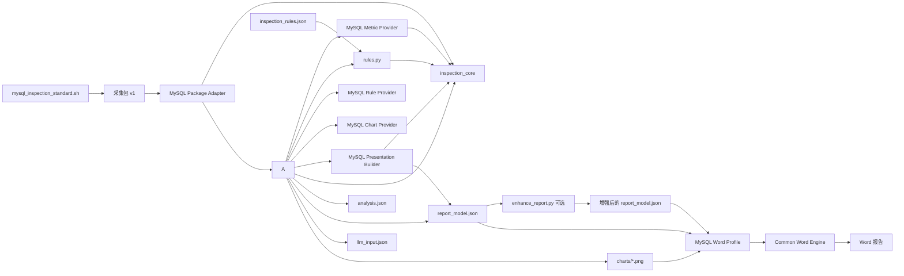

# MySQL 巡检项目地图

> 状态：阶段 11 当前实现。MySQL 已完成解耦和专业报告；PostgreSQL 已接入公共核心、公共 Word 引擎并完成分析器内部解耦；Oracle 与 SQL Server 均已接入报告契约适配器与公共 Word Profile；公共 Linux 采集层已进入 C0/C1 抽取。目标形态另见 `docs/architecture-target.md` 与 `docs/collector-target.md`。

## 1. 当前主流程

```text
mysql_inspection_standard.sh
  -> 采集包 tar.gz
  -> analyze_inspection_v2.py
       -> analysis.json
       -> report_model.json
       -> llm_input.json
       -> charts/*.png
  -> enhance_report.py（可选，只增强文字）
  -> generate_report_docx_v3.py
       -> plugins/mysql/word_report.py
       -> inspection_core/word_engine.py
       -> *.docx
```

当前约有 72 个采集状态项、24 条规则和 30 余个报告检查项。三者不是一一对应：一个报告项可能组合多个采集项，一个规则也可能使用多个文件和派生指标。

## 2. 文件职责

| 文件 | 主要职责 | 输入 | 输出 | 直接依赖/使用者 | 修改风险 |
|---|---|---|---|---|---|
| `mysql_inspection_standard.sh` | 在数据库服务器执行只读采集、能力探测、状态登记、打包和哈希清单 | MySQL 连接参数、主机命令 | tar.gz 采集包 | 被分析器消费 | 高：字段、文件名、item_id 变化会影响分析器 |
| `inspection_core/` | 定义跨分析器共用的数据模型和安全数值转换 | 标准 Python 值 | `Finding`、`RuleEvaluation`、`PackageContext` | 被分析器和规则模块单向依赖 | 低：公共契约变更必须通过基线测试 |
| `plugins/mysql/package_adapter.py` | 识别并加载 MySQL collector v1 物理包，校验版本和 manifest | tar.gz 或已解压目录 | 标准 `PackageContext` | 分析器只通过该适配器读取采集包 | 中：采集布局兼容逻辑集中在这里 |
| `plugins/mysql/metrics.py` | 计算 MySQL 计数器速率、容量、结构、活动和主机指标 | 标准 `PackageContext` | 规则与报告共用的 metrics | 被分析器单向调用；规则只消费结果 | 中：采集字段变化主要在此兼容 |
| `inspection_core/statistics.py`、`sampling.py` | 跨数据库统计汇总和 SAR 历史质量判断 | 标准数值、`PackageContext` | 汇总统计、历史可用性 | 可被四库指标插件复用 | 低到中：修改需跨库回归 |
| `inspection_core/reporting.py` | 公共整改动作和证据披露模型 | 风险、证据不足、许可/节点范围 | 兼容旧格式或扩展管理字段 | 四库 presentation 可复用 | 低到中：公共报告语义需版本化 |
| `plugins/mysql/presentation.py` | 构造 MySQL 9 个章节、33 个检查项、管理摘要和 report model | facts、metrics、findings | `inspection_sections`、`report_model` | 分析器单向调用；Word 只消费输出 | 高：MySQL 报告内容修改集中在这里 |
| `plugins/mysql/charts.py` | 生成 MySQL 与主机性能图表，包含 Matplotlib/Pillow 兼容路径 | context、metrics | PNG 和 chart metadata | 分析器单向调用 | 中：图表改动必须做严格元数据和PNG指纹回归 |
| `plugins/mysql/rules.py` | 执行 MySQL 24条规则并提供 Rule Provider | `PackageContext`、metrics、规则 JSON | `Finding`、`RuleEvaluation` | 仅依赖公共模型 | 中到高：规则逻辑集中在这里 |
| `rules.py` | 旧导入路径兼容入口 | 无独立逻辑 | 重导出 MySQL RuleEngine/Provider | 供旧脚本或测试兼容 | 低：不得重新加入业务逻辑 |
| `analyze_inspection_v2.py` | 流程编排、采集质量、拓扑、健康汇总和输出落盘 | 采集包、规则配置 | `analysis.json`、`report_model.json`、`llm_input.json`、图表 | 单向调用五个 MySQL Provider | 中：保持数据库独立入口，不承载插件业务 |
| `inspection_rules.json` | 规则元数据、阈值、严重性、建议 | 无 | 供 `rules.py` 读取 | 与 `rules.py` 中的检查方法共同决定规则是否真正执行 | 中：只增加 JSON 不能自动增加执行逻辑 |
| `inspection_core/word_engine.py` | 数据库无关的 Word 页面、主题、事实章节、章末分析、风险、整改闭环和附录渲染 | 标准报告模型、Word Profile、图表、Logo、布局版本 | `.docx` | 只依赖 `python-docx`，不得导入数据库插件 | 中：公共版式修改需四库 Word 回归 |
| `plugins/mysql/word_report.py` | MySQL Word Profile：契约、数据库名称、章节顺序、图表映射和采样字段 | MySQL `report_model.json` | MySQL 渲染配置和生成器适配器 | 被 MySQL 独立 Word 入口调用 | 中：MySQL 专属展示变化集中在这里 |
| `generate_report_docx_v3.py` | MySQL 独立 Word 命令行兼容入口，默认专业版并可选旧版 | `report_model.json`、客户参数、`--layout` | `.docx` | 调用 MySQL Word Profile 和公共引擎 | 低：不得重新加入排版或业务章节逻辑 |
| `enhance_report.py` | 可选 LLM 文字增强 | `report_model.json`、API 配置 | 增强后的报告模型 | 不能作为事实、评分或规则判断来源 | 中：四种数据库存在大量重复实现 |
| `chart_style.py` | matplotlib 样式和配色 | 图表调用 | 样式配置 | 被分析器生成图表时使用 | 低到中：MySQL 与 Oracle 高度重复 |
| `logo.png` | 默认品牌资源 | 无 | Word 中的 Logo | 报告生成器 | 低 |
| `README.md` | 当前使用说明、目录用途和最短运行命令 | 无 | 人工说明 | 用户 | 低：版本或入口变化时同步更新 |
| `requirements.txt` | Python 运行依赖 | 无 | pip 安装清单 | 用户、运行环境 | 低：增加第三方依赖时同步更新 |

## 3. 当前依赖关系



## 4. 从哪里开始修改

| 需求 | 当前需要检查的文件 | 当前连带风险 |
|---|---|---|
| 新增采集 SQL，只展示数据 | 采集脚本、MySQL adapter、`plugins/mysql/presentation.py`、测试样例 | 若不参与判断，通常不需要修改 metrics/rules/Word |
| 新增有阈值的规则 | 采集脚本、`plugins/mysql/metrics.py`、`plugins/mysql/rules.py`、规则 JSON、报告结论 | JSON 不是完整的声明式规则，仍需 Python 方法 |
| 修改采集字段名 | 采集脚本、MySQL adapter、MySQL metrics、报告 item | 旧版本兼容集中在 adapter/metrics，仍缺逐检查项 schema_version |
| 修改 Word 样式或专业版结构 | `inspection_core/word_engine.py`，必要时 `plugins/mysql/word_report.py` | 不改采集、指标、规则；旧版兼容布局必须继续回归 |
| 修改报告章节 | `plugins/mysql/presentation.py`、`plugins/mysql/word_report.py` | presentation 决定语义，Profile 决定顺序和专属图表映射 |
| 修改 LLM 表述 | `enhance_report.py` | 必须确保不改变事实、状态、评分和证据 |

更完整的操作说明见 `docs/change-impact-matrix.md`。

## 5. 跨数据库可复用资产

| 项目 | 应吸收的能力 |
|---|---|
| MySQL | manifest 哈希、采集状态、缺失值策略、`collection/display/analysis` item 模型 |
| Oracle | 触发/通过/未评价/不适用四态、许可边界、证据不足披露 |
| PostgreSQL | 分析器依赖规则模型的方向、多节点支持、较清晰的 `_item` 模式 |
| SQL Server | JSON 采集包、语义化管理章节、较短的分析器、数据驱动 sections |

## 6. 已确认的主要问题

1. ~~`rules.py` 与分析器循环依赖。~~ 已在阶段 1 第一刀中通过 `inspection_core/` 消除；后续四库插件统一依赖该公共方向。
2. ~~分析器同时负责解包、解析、指标、规则、图表和报告构造。~~ 五类插件能力均已拆出；分析器保留独立入口和流程编排。
3. 报告模型已有良好雏形，但四种数据库的 contract 和 item 格式尚未统一。
4. ~~Word 生成器硬编码 MySQL 章节和目录。~~ 阶段 5 已抽为公共引擎 + MySQL Word Profile；阶段 6 增加版本化专业布局和旧版兼容布局。
5. 阶段 0 开始时 MySQL 没有回归样例；现已补充完整采集包及 `tests/baselines/mysql/current/` 输出基线。
6. README 与实际代码缺少自动校验，其他数据库项目已经出现文档列出的文件与磁盘实际文件不一致。

## 7. 阶段 0 文档入口

- `docs/baseline-inventory.md`：文件版本、哈希与样例状态。
- `docs/architecture-current.md`：现状数据流、契约和耦合点。
- `docs/check-catalog.yaml`：MySQL 采集项、报告项、规则及已知映射缺口。
- `docs/change-impact-matrix.md`：不同修改类型应检查什么。
- `tests/fixtures/README.md`：内部完整回归样例的登记、安全边界和验收要求。

## 8. 阶段 0.5 目标设计入口

- `docs/cross-database-capability-matrix.md`：四套实现的差异、采用和不采用决策。
- `docs/architecture-target.md`：公共核心、插件、依赖方向和第一次 MySQL 解耦边界。
- `contracts/README.md`：collection、rule、report 三类目标契约及迁移说明。
- `docs/collector-capability-matrix.md`：四个采集脚本的公共系统能力和缺口。
- `docs/collector-target.md`：公共 Linux/Windows 采集层、数据库插件和独立交付入口。

## 9. 阶段 1 已落地内容

- `inspection_core/models.py`：公共 Finding、RuleEvaluation、PackageContext。
- `inspection_core/values.py`：公共安全数值转换，不再从分析器反向复用函数。
- `inspection_core/package_io.py`、`inspection_core/tabular.py`：安全包读取和公共表格解析。
- `plugins/mysql/package_adapter.py`：MySQL v1 采集包的识别、版本校验、完整性校验和物理布局解析。
- `tests/test_inspection_core.py`：公共模型与契约单元测试。
- `tests/test_mysql_package_adapter.py`：使用登记的完整采集包验证 adapter。
- `tests/compare_analysis_outputs.py`：区分业务结果与时间/绘图环境噪声的基线比较工具。

## 10. 阶段 2 已落地内容

- `plugins/mysql/metrics.py`：MySQL 指标计算唯一实现，不生成报告、不执行规则。
- `inspection_core/statistics.py`：跨数据库统计汇总。
- `inspection_core/sampling.py`：跨数据库 SAR 历史覆盖、新鲜度和点数判断。
- `tests/test_mysql_metrics.py`：计数器重置、缺失/空结果、远程主机和 SAR 边界测试。
- `analyze_inspection_v2.py` 从 142,817 字节降至 124,495 字节；真实包业务基线保持一致。

## 11. 阶段 3 已落地内容

- `plugins/mysql/presentation.py`：MySQL 章节、检查项、管理摘要和 report model 的唯一构造入口。
- `inspection_core/reporting.py`：可兼容现有 MySQL JSON，并预留责任人、整改窗口、验证方式、许可边界和节点范围。
- `tests/test_mysql_presentation.py`：锁定9个章节、33个唯一 item、报告字段结构和冻结 report_model。
- `analyze_inspection_v2.py` 从 124,495 字节降至 56,123 字节；真实包三份业务 JSON 保持一致。
- 当前发现两个历史 item 使用 `analysis.status=ok`，已登记为统一报告契约的版本化迁移项。

## 12. 阶段 4 已落地内容

- `plugins/mysql/charts.py`：图表唯一实现；同环境严格 JSON 和6张PNG指纹保持一致。
- `plugins/mysql/rules.py`：MySQL RuleEngine 与 Rule Provider；根目录 `rules.py` 仅兼容重导出。
- `tests/test_mysql_providers.py`：规则覆盖唯一性、兼容入口和图表产物测试。
- `analyze_inspection_v2.py` 从 56,123 字节降至 29,008 字节、591行。
- 阶段 4 后 MySQL 仍是独立运行入口，没有合并成四库巨型分析器。

## 13. 阶段 5 已落地内容

- `inspection_core/word_engine.py`：数据库无关的 Word 渲染器，不导入任何数据库插件。
- `plugins/mysql/word_report.py`：MySQL 契约、章节顺序、图表映射和数据库名称配置。
- `generate_report_docx_v3.py`：97 行兼容入口，原有命令和参数继续可用。
- 吸收 Oracle 的动态目录/章节编号、PostgreSQL 的章节图表映射和 SQL Server 的管理型风险结构边界。
- `tests/test_word_engine.py`：锁定拆分前可见内容、MySQL Profile、独立入口和图片替代文字。
- 22 项测试、业务 JSON 和同渲染环境严格图表回归通过；Word 的45张表格几何、标题层级、页面设置和7张图片结构审计通过。
- 当前机器缺少 LibreOffice，仍不能声称已经完成 DOCX 到 PNG 的逐页视觉验收。

## 14. 阶段 6 已落地内容

- 公共 Word 引擎升级为 4.1.0，新增 `professional` 与 `legacy` 两种版本化布局；MySQL 独立入口默认专业版，可用 `--layout legacy` 复现 4.0 内容结构。
- 专业版按“巡检事实与图表 → 本章分析结论”组织 9 个技术章节，分析仍直接读取 report model，不重新判断。
- 风险登记册、分级整改与闭环计划、综合结论与管理建议、证据索引成为独立章节；模型未提供的责任人、窗口和状态明确标记为待指定或未登记。
- 使用专业参考 PDF 的封面、文档控制、编号和事实优先结构，同时避免把大量原始账户/权限明细堆入管理主文。
- 24 项自动测试和三份业务 JSON 基线通过；专业版 59 张表、7 张图片、标题层级、页面设置和可访问性通过结构审计。
- 当前机器仍缺少 LibreOffice，因此逐页 PNG 视觉验收待在具备转换组件的环境补做。

## 15. 阶段 7 已落地内容

- 公共 Word 引擎升级为 4.2.0；专业版标题、表头和正文采用黑色/深灰层级，仅风险级别保留红、橙、黄色。
- 专业版去除表后占位短横线和空白页；报告由 39 页收敛为 34 页，仍保持“事实与图表在前、本章结论在后”。
- 正文对 SQL 摘要、等待事件、文件 I/O、插件和配置明细设置展示上限；完整行数及保留位置通过说明披露，事实数据未删除。
- 图表优先使用可用 SAR 历史；现场短采样改用实际 `HH:mm:ss` 时间轴，启动点从趋势线中排除但保留在分析 JSON 并在图内披露。
- 内存图统一为百分比；磁盘图拆分吞吐、繁忙度和响应时间，消除混合单位纵轴；Matplotlib 与 Pillow fallback 均支持中文字体和时间标签。
- 修正“30.83 小时 SAR 可用”与正文“历史不完整”的矛盾；主机本地时间显示为 `UTC+08:00`，文档控制时间显示为“本地时间”。
- 27 项自动测试通过；旧版 Word 内容哈希保持不变。基线差异仅为上述 SAR 结论纠正及两处时间显示格式化，风险、评分、规则状态和证据未改变。
- 使用本机 Word 导出 PDF 并将 34 页全部渲染为 PNG 检查；未发现空白页、乱码、方框字、裁切、重叠或表头孤立。

## 16. 阶段 8 已落地内容

- 冻结 PG 2.0.1 真实采集包、旧分析 JSON、旧报告模型和旧 Word；登记路径、大小、SHA256 与业务统计。
- 新增 `plugins/postgresql/`，PG 保持独立规则与分析入口，同时复用公共 `PackageContext`、安全解包、表格解析、数值转换、统计和 Word 引擎。
- 新增 `analyze_postgresql.py` 独立入口：保留 `report_model_legacy.json`，并生成标准 `postgresql_inspection_report_model`。
- 新增 `plugins/postgresql/report_adapter.py`：只重组既有事实，不重算评分或规则；旧严重性映射时保留 `source_severity`。
- 新增 `plugins/postgresql/word_report.py` 和 `generate_postgresql_report.py`，14 个 PG 章节由公共 4.2.0 专业 Word 引擎渲染。
- 修正 PG CPU 图误把 idle 当使用率、采集/分析时间混用、版本前缀重复、采样点误报未采集和备份证据不足误写风险的问题。
- 30 项自动测试通过；PG 基线为 1 实例、36 条规则、2 条风险、14 章节、14 项、5 图、健康分 90、数据质量 93.5%。
- PG 专业报告经 Word 导出为 23 页并逐页检查；无乱码、方框字、裁切、重叠和空白页；可访问性审计 0 项问题。

## 17. 阶段 9：PostgreSQL 分析器内部解耦

- `plugins/postgresql/package_adapter.py`：唯一负责 PG 包解压、表格载入、manifest 校验、`PackageContext` 建立和采集质量统计。
- `plugins/postgresql/rule_provider.py`：规则编排入口；分析器不再直接实例化 `RuleEngine`。
- `plugins/postgresql/parsers.py`：集中解析 SAR、文件系统与内存快照，不做阈值判断。
- `plugins/postgresql/metrics.py`：集中派生51项指标，不运行规则、不生成报告文字。
- `plugins/postgresql/charts.py`：集中生成5张PG图表及处理时间轴，不参与风险判断。
- `plugins/postgresql/analyzer.py`：继续作为独立流程编排器；下一步只需迁移旧报告模型和综合结论构建。
- 兼容要求：`analyze_postgresql.py` 命令、标准/旧报告模型以及 PG 阶段 8 基线保持不变。
- 阶段首批 34 项测试通过；PG 的 `analysis.json`、标准 `report_model.json` 和 `llm_input.json` 与冻结基线完全一致。MySQL 回归仅出现阶段 7 已登记的 5 项预期展示差异，风险与 LLM 输入未变化。
- 指标与图表迁移后再次通过34项测试、PG业务JSON回归和严格图表回归；51项指标、36条规则、2条风险及5张图均保持不变。

## 18. 阶段 10：Oracle 报告契约适配器与 Word Profile 接入

- 冻结 Oracle 真实采集包、外部分析 JSON、原始报告模型与 LLM 输入；登记路径、大小、SHA256 与业务统计。
- 新增 `plugins/oracle/report_adapter.py`：只重组既有事实，不重算评分、规则或严重性；为 48 个巡检项补充稳定 `item_id`，把纯事实项归一为 `normal`、无结构化记录项保留 `not_evaluated`，并为 finding 保留 `source_severity`。
- 新增 `plugins/oracle/word_report.py` 和 `generate_oracle_report.py`，9 个 Oracle 章节由公共 4.2.0 专业 Word 引擎渲染，并映射 9 张图表（system_performance 5 张、oracle_performance 4 张）。
- 公共 Word 引擎综合摘要把 `critical` 计入“高风险”列；MySQL/PG 无 critical，旧版 Word 内容哈希保持不变。
- 基线：1 实例、34 条规则（10 触发/20 通过/4 未评价）、10 条风险（1 critical/2 high/5 medium/2 low）、9 章节、48 项、9 图、健康分 43。
- 48 项自动测试通过；MySQL 与 PG 业务 JSON、旧版 Word 哈希及专业版回归均未新增差异。逐页 PNG 视觉验收仍待具备 LibreOffice 的环境补做。

## 19. 阶段 11：SQL Server 报告契约适配器与 Word Profile 接入

- 冻结 SQL Server 真实采集包、外部分析 JSON、原始报告模型与旧版 Word；登记路径、大小、SHA256 与业务统计。
- 新增 `plugins/sqlserver/report_adapter.py`：以结构化 `sections` 为唯一章节来源，忽略说明性 `inspection_sections`；把 headers+二维 rows 归一为列表字典、`success` 归一为 `ok`；为 27 个巡检项补充稳定 `item_id`；纯事实项归一为 `normal`，规则项保留 `risk/attention`；finding 保留 `source_severity` 并把 owner/target_window/verification/status 迁入整改计划。
- 新增 `plugins/sqlserver/word_report.py` 和 `generate_sqlserver_report.py`，12 个 SQL Server 章节由公共 4.2.0 专业 Word 引擎渲染，并映射 8 张技术图表。
- 基线：1 实例、14 条规则全部触发、24 条风险（8 critical/9 high/6 medium/1 low）、12 章节、27 项、9 图、健康分 0。
- 48 项自动测试通过；MySQL、PG、Oracle 业务 JSON、旧版 Word 哈希及专业版回归均未新增差异。逐页 PNG 视觉验收仍待具备 LibreOffice 的环境补做。

## 20. 阶段 12：公共 Linux 采集层 C0/C1

- C0 冻结公共系统检查目录与字段 schema：`collectors/common/contract/linux-common-checks.yaml`（26 项公共检查 + 8 个公共模块 + 插件 hook 与主机归属证据契约）。
- C1 抽取 MySQL/PG 共有的数据库无关函数，落地 `collectors/common/linux/{util,runtime,status,security,package}.sh`；公共模块只定义函数，依赖入口全局变量，并通过 `known_tsv_header`/`cleanup_auth` hook 注入数据库差异。
- 新增 `collectors/tests/test_common_linux.sh`，在 Git Bash 下覆盖 id 清洗、JSON 转义、数值判定、SHA256、状态登记、TSV 列过滤、敏感扫描与 manifest 生成，15 项断言通过，模块全部通过 `bash -n`。
- 尚未抽取 system_static/sampling/sar（后续 C1 续做）；SQL Server Windows 公共层与四库统一发布构建分别属于 C3/C4。
