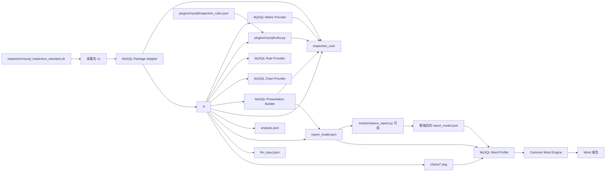

# MySQL 巡检项目地图

> 状态：阶段 12 之后做过一轮仓库整理（阶段 13，见第 21 节）。
> MySQL 已完成解耦和专业报告；PostgreSQL 已接入公共核心、公共 Word 引擎并完成分析器内部解耦；Oracle 与 SQL Server 均已接入报告契约适配器与公共 Word Profile；公共 Linux 采集层在阶段 12 进入 C0/C1 抽取，但其产物目录不在本工作树内（见第 21 节）。
>
> 本文件与其余架构文档同在 `docs/` 下，文内引用同目录文件时直接写文件名。**当前实现一律以磁盘实际文件为准。**

## 1. 当前主流程

```text
inspection/mysql_inspection_standard.sh
  -> 采集包 tar.gz
analyze.py（统一入口，按库分发到 plugins/<db>/）
  -> plugins/mysql/analyzer.py
       -> analysis.json
       -> report_model.json
       -> llm_input.json
       -> charts/*.png
  -> tools/enhance_report.py（可选，只增强文字）
generate_report.py（统一入口，按 generator_contract 分发）
       -> plugins/mysql/word_report.py
       -> inspection_core/word_engine.py
       -> *.docx
```

当前约有 72 个采集状态项、24 条规则和 30 余个报告检查项。三者不是一一对应：一个报告项可能组合多个采集项，一个规则也可能使用多个文件和派生指标。

## 2. 文件职责

| 文件 | 主要职责 | 输入 | 输出 | 直接依赖/使用者 | 修改风险 |
|---|---|---|---|---|---|
| `inspection/mysql_inspection_standard.sh` | 在数据库服务器执行只读采集、能力探测、状态登记、打包和哈希清单 | MySQL 连接参数、主机命令 | tar.gz 采集包 | 被分析器消费 | 高：字段、文件名、item_id 变化会影响分析器 |
| `inspection_core/` | 定义跨分析器共用的数据模型和安全数值转换 | 标准 Python 值 | `Finding`、`RuleEvaluation`、`PackageContext` | 被分析器和规则模块单向依赖 | 低：公共契约变更必须通过基线测试 |
| `plugins/mysql/package_adapter.py` | 识别并加载 MySQL collector v1 物理包，校验版本和 manifest | tar.gz 或已解压目录 | 标准 `PackageContext` | 分析器只通过该适配器读取采集包 | 中：采集布局兼容逻辑集中在这里 |
| `plugins/mysql/metrics.py` | 计算 MySQL 计数器速率、容量、结构、活动和主机指标 | 标准 `PackageContext` | 规则与报告共用的 metrics | 被分析器单向调用；规则只消费结果 | 中：采集字段变化主要在此兼容 |
| `inspection_core/statistics.py`、`sampling.py` | 跨数据库统计汇总和 SAR 历史质量判断 | 标准数值、`PackageContext` | 汇总统计、历史可用性 | 可被四库指标插件复用 | 低到中：修改需跨库回归 |
| `inspection_core/reporting.py` | 公共整改动作和证据披露模型 | 风险、证据不足、许可/节点范围 | 兼容旧格式或扩展管理字段 | 四库 presentation 可复用 | 低到中：公共报告语义需版本化 |
| `plugins/mysql/presentation.py` | 构造 MySQL 9 个章节、33 个检查项、管理摘要和 report model | facts、metrics、findings | `inspection_sections`、`report_model` | 分析器单向调用；Word 只消费输出 | 高：MySQL 报告内容修改集中在这里 |
| `plugins/mysql/charts.py` | 生成 MySQL 与主机性能图表，包含 Matplotlib/Pillow 兼容路径 | context、metrics | PNG 和 chart metadata | 分析器单向调用 | 中：图表改动必须做严格元数据和PNG指纹回归 |
| `plugins/mysql/rules.py` | 执行 MySQL 24条规则并提供 Rule Provider | `PackageContext`、metrics、规则 JSON | `Finding`、`RuleEvaluation` | 仅依赖公共模型 | 中到高：规则逻辑集中在这里 |
| `analyze.py` | 统一分析入口，按数据库类型分发到 `plugins/<db>/`；**支持多包输入**（多实例/主从合并），混合库型与 SQL Server 多包在此拦下 | 采集包（可多个）、`--db-type` | 子进程调用各库分析器 | 用户唯一分析入口 | 低：只做分发，不承载业务；**参数面必须是各库本体的超集** |
| `plugins/mysql/analyzer.py` | 流程编排、采集质量、拓扑、健康汇总和输出落盘 | 采集包、规则配置 | `analysis.json`、`report_model.json`、`llm_input.json`、图表 | 单向调用五个 MySQL Provider | 中：保持数据库独立入口，不承载插件业务 |
| `plugins/mysql/inspection_rules.json` | 规则元数据、阈值、严重性、建议 | 无 | 供 `plugins/mysql/rules.py` 读取 | 与 `rules.py` 中的检查方法共同决定规则是否真正执行 | 中：只增加 JSON 不能自动增加执行逻辑 |
| `inspection_core/word_engine.py` | 数据库无关的 Word 页面、主题、事实章节、章末分析、风险、整改闭环和附录渲染 | 标准报告模型、Word Profile、图表、Logo、布局版本 | `.docx` | 只依赖 `python-docx`，不得导入数据库插件 | 中：公共版式修改需四库 Word 回归 |
| `plugins/mysql/word_report.py` | MySQL Word Profile：契约、数据库名称、章节顺序、图表映射和采样字段 | MySQL `report_model.json` | MySQL 渲染配置和生成器适配器 | 被统一 Word 入口调用 | 中：MySQL 专属展示变化集中在这里 |
| `generate_report.py` | 统一 Word 命令行入口，按 `generator_contract` 分发到四库 Word Profile，默认专业版并可选旧版 | `report_model.json`、客户参数、`--layout` | `.docx` | 调用 Word Profile 和公共引擎 | 低：不得重新加入排版或业务章节逻辑 |
| `tools/enhance_report.py` | 可选 LLM 文字增强 | `report_model.json`、API 配置 | 增强后的报告模型 | 不能作为事实、评分或规则判断来源 | 中：四种数据库存在大量重复实现 |
| `plugins/mysql/chart_style.py` | matplotlib 样式和配色 | 图表调用 | 样式配置 | 被 `plugins/mysql/charts.py` 以相对导入使用 | 低到中：与 Oracle/SQL Server 的同类文件各自演化，尚未合并 |
| `assets/logo.png` | 默认品牌资源 | 无 | Word 中的 Logo | 报告生成器 | 低 |
| `README.md` | 当前使用说明、目录用途和最短运行命令 | 无 | 人工说明 | 用户 | 低：版本或入口变化时同步更新 |
| `requirements.txt` | Python 运行依赖 | 无 | pip 安装清单 | 用户、运行环境 | 低：增加第三方依赖时同步更新 |

## 3. 当前依赖关系



## 4. 从哪里开始修改

| 需求 | 当前需要检查的文件 | 当前连带风险 |
|---|---|---|
| 新增采集 SQL，只展示数据 | 采集脚本、MySQL adapter、`plugins/mysql/presentation.py`、测试样例 | 若不参与判断，通常不需要修改 metrics/rules/Word |
| 新增有阈值的规则 | 采集脚本、`plugins/mysql/metrics.py`、`plugins/mysql/rules.py`、规则 JSON、报告结论 | JSON 不是完整的声明式规则，仍需 Python 方法 |
| 修改采集字段名 | 采集脚本、MySQL adapter、MySQL metrics、报告 item | 旧版本兼容集中在 adapter/metrics，仍缺逐检查项 schema_version |
| 修改 Word 样式或专业版结构 | `inspection_core/word_engine.py`，必要时 `plugins/mysql/word_report.py` | 不改采集、指标、规则；旧版兼容布局必须继续回归 |
| 修改报告章节 | `plugins/mysql/presentation.py`、`plugins/mysql/word_report.py` | presentation 决定语义，Profile 决定顺序和专属图表映射 |
| 修改 LLM 表述 | `tools/enhance_report.py` | 必须确保不改变事实、状态、评分和证据 |

更完整的操作说明见 `docs/change-impact-matrix.md`。

## 5. 跨数据库可复用资产

| 项目 | 应吸收的能力 |
|---|---|
| MySQL | manifest 哈希、采集状态、缺失值策略、`collection/display/analysis` item 模型 |
| Oracle | 触发/通过/未评价/不适用四态、许可边界、证据不足披露 |
| PostgreSQL | 分析器依赖规则模型的方向、多节点支持、较清晰的 `_item` 模式 |
| SQL Server | JSON 采集包、语义化管理章节、较短的分析器、数据驱动 sections |

## 6. 已确认的主要问题

1. ~~`rules.py` 与分析器循环依赖。~~ 已在阶段 1 第一刀中通过 `inspection_core/` 消除；后续四库插件统一依赖该公共方向。
2. ~~分析器同时负责解包、解析、指标、规则、图表和报告构造。~~ 五类插件能力均已拆出；分析器保留独立入口和流程编排。
3. 报告模型已有良好雏形，但四种数据库的 contract 和 item 格式尚未统一。
4. ~~Word 生成器硬编码 MySQL 章节和目录。~~ 阶段 5 已抽为公共引擎 + MySQL Word Profile；阶段 6 增加版本化专业布局和旧版兼容布局。
5. 阶段 0 开始时 MySQL 没有回归样例；现已补充完整采集包及 `tests/baselines/mysql/current/` 输出基线。
6. README 与实际代码缺少自动校验，其他数据库项目已经出现文档列出的文件与磁盘实际文件不一致。

## 7. 阶段 0 文档入口

同目录下：

- `baseline-inventory.md`：文件版本、哈希与样例状态（记录的是整理前的历史快照，文件位置已在阶段 13 变更）。
- `architecture-current.md`：现状数据流、契约和耦合点。
- `check-catalog.yaml`：MySQL 采集项、报告项、规则及已知映射缺口。
- `change-impact-matrix.md`：不同修改类型应检查什么。
- `../tests/fixtures/README.md`：内部完整回归样例的登记、安全边界和验收要求。

## 8. 阶段 0.5 目标设计入口

同目录下：

- `cross-database-capability-matrix.md`：四套实现的差异、采用和不采用决策。
- `architecture-target.md`：公共核心、插件、依赖方向和第一次 MySQL 解耦边界。
- `../contracts/README.md`：collection、rule、report 三类目标契约及迁移说明。
- `collector-capability-matrix.md`：四个采集脚本的公共系统能力和缺口。
- `collector-target.md`：公共 Linux/Windows 采集层、数据库插件和独立交付入口。

## 9. 阶段 1 已落地内容

- `inspection_core/models.py`：公共 Finding、RuleEvaluation、PackageContext。
- `inspection_core/values.py`：公共安全数值转换，不再从分析器反向复用函数。
- `inspection_core/package_io.py`、`inspection_core/tabular.py`：安全包读取和公共表格解析。
- `plugins/mysql/package_adapter.py`：MySQL v1 采集包的识别、版本校验、完整性校验和物理布局解析。
- `tests/test_inspection_core.py`：公共模型与契约单元测试。
- `tests/test_mysql_package_adapter.py`：使用登记的完整采集包验证 adapter。
- `tests/compare_analysis_outputs.py`：区分业务结果与时间/绘图环境噪声的基线比较工具。

## 10. 阶段 2 已落地内容

- `plugins/mysql/metrics.py`：MySQL 指标计算唯一实现，不生成报告、不执行规则。
- `inspection_core/statistics.py`：跨数据库统计汇总。
- `inspection_core/sampling.py`：跨数据库 SAR 历史覆盖、新鲜度和点数判断。
- `tests/test_mysql_metrics.py`：计数器重置、缺失/空结果、远程主机和 SAR 边界测试。
- `analyze_inspection_v2.py` 从 142,817 字节降至 124,495 字节；真实包业务基线保持一致。

## 11. 阶段 3 已落地内容

- `plugins/mysql/presentation.py`：MySQL 章节、检查项、管理摘要和 report model 的唯一构造入口。
- `inspection_core/reporting.py`：可兼容现有 MySQL JSON，并预留责任人、整改窗口、验证方式、许可边界和节点范围。
- `tests/test_mysql_presentation.py`：锁定9个章节、33个唯一 item、报告字段结构和冻结 report_model。
- `analyze_inspection_v2.py` 从 124,495 字节降至 56,123 字节；真实包三份业务 JSON 保持一致。
- 当前发现两个历史 item 使用 `analysis.status=ok`，已登记为统一报告契约的版本化迁移项。

## 12. 阶段 4 已落地内容

- `plugins/mysql/charts.py`：图表唯一实现；同环境严格 JSON 和6张PNG指纹保持一致。
- `plugins/mysql/rules.py`：MySQL RuleEngine 与 Rule Provider。（旧的根目录 `rules.py` 兼容壳已在阶段 13 删除。）
- `tests/test_mysql_providers.py`：规则覆盖唯一性、兼容入口和图表产物测试。
- `analyze_inspection_v2.py` 从 56,123 字节降至 29,008 字节、591行。
- 阶段 4 后 MySQL 仍是独立运行入口，没有合并成四库巨型分析器。

## 13. 阶段 5 已落地内容

- `inspection_core/word_engine.py`：数据库无关的 Word 渲染器，不导入任何数据库插件。
- `plugins/mysql/word_report.py`：MySQL 契约、章节顺序、图表映射和数据库名称配置。
- `generate_report_docx_v3.py`：97 行兼容入口，原有命令和参数继续可用。
- 吸收 Oracle 的动态目录/章节编号、PostgreSQL 的章节图表映射和 SQL Server 的管理型风险结构边界。
- `tests/test_word_engine.py`：锁定拆分前可见内容、MySQL Profile、独立入口和图片替代文字。
- 22 项测试、业务 JSON 和同渲染环境严格图表回归通过；Word 的45张表格几何、标题层级、页面设置和7张图片结构审计通过。
- 当前机器缺少 LibreOffice，仍不能声称已经完成 DOCX 到 PNG 的逐页视觉验收。

## 14. 阶段 6 已落地内容

- 公共 Word 引擎升级为 4.1.0，新增 `professional` 与 `legacy` 两种版本化布局；MySQL 独立入口默认专业版，可用 `--layout legacy` 复现 4.0 内容结构。
- 专业版按“巡检事实与图表 → 本章分析结论”组织 9 个技术章节，分析仍直接读取 report model，不重新判断。
- 风险登记册、分级整改与闭环计划、综合结论与管理建议、证据索引成为独立章节；模型未提供的责任人、窗口和状态明确标记为待指定或未登记。
- 使用专业参考 PDF 的封面、文档控制、编号和事实优先结构，同时避免把大量原始账户/权限明细堆入管理主文。
- 24 项自动测试和三份业务 JSON 基线通过；专业版 59 张表、7 张图片、标题层级、页面设置和可访问性通过结构审计。
- 当前机器仍缺少 LibreOffice，因此逐页 PNG 视觉验收待在具备转换组件的环境补做。

## 15. 阶段 7 已落地内容

- 公共 Word 引擎升级为 4.2.0；专业版标题、表头和正文采用黑色/深灰层级，仅风险级别保留红、橙、黄色。
- 专业版去除表后占位短横线和空白页；报告由 39 页收敛为 34 页，仍保持“事实与图表在前、本章结论在后”。
- 正文对 SQL 摘要、等待事件、文件 I/O、插件和配置明细设置展示上限；完整行数及保留位置通过说明披露，事实数据未删除。
- 图表优先使用可用 SAR 历史；现场短采样改用实际 `HH:mm:ss` 时间轴，启动点从趋势线中排除但保留在分析 JSON 并在图内披露。
- 内存图统一为百分比；磁盘图拆分吞吐、繁忙度和响应时间，消除混合单位纵轴；Matplotlib 与 Pillow fallback 均支持中文字体和时间标签。
- 修正“30.83 小时 SAR 可用”与正文“历史不完整”的矛盾；主机本地时间显示为 `UTC+08:00`，文档控制时间显示为“本地时间”。
- 27 项自动测试通过；旧版 Word 内容哈希保持不变。基线差异仅为上述 SAR 结论纠正及两处时间显示格式化，风险、评分、规则状态和证据未改变。
- 使用本机 Word 导出 PDF 并将 34 页全部渲染为 PNG 检查；未发现空白页、乱码、方框字、裁切、重叠或表头孤立。

## 16. 阶段 8 已落地内容

- 冻结 PG 2.0.1 真实采集包、旧分析 JSON、旧报告模型和旧 Word；登记路径、大小、SHA256 与业务统计。
- 新增 `plugins/postgresql/`，PG 保持独立规则与分析入口，同时复用公共 `PackageContext`、安全解包、表格解析、数值转换、统计和 Word 引擎。
- 新增 `analyze_postgresql.py` 独立入口：保留 `report_model_legacy.json`，并生成标准 `postgresql_inspection_report_model`。
- 新增 `plugins/postgresql/report_adapter.py`：只重组既有事实，不重算评分或规则；旧严重性映射时保留 `source_severity`。
- 新增 `plugins/postgresql/word_report.py` 和 `generate_postgresql_report.py`，14 个 PG 章节由公共 4.2.0 专业 Word 引擎渲染。
- 修正 PG CPU 图误把 idle 当使用率、采集/分析时间混用、版本前缀重复、采样点误报未采集和备份证据不足误写风险的问题。
- 30 项自动测试通过；PG 基线为 1 实例、36 条规则、2 条风险、14 章节、14 项、5 图、健康分 90、数据质量 93.5%。
- PG 专业报告经 Word 导出为 23 页并逐页检查；无乱码、方框字、裁切、重叠和空白页；可访问性审计 0 项问题。

## 17. 阶段 9：PostgreSQL 分析器内部解耦

- `plugins/postgresql/package_adapter.py`：唯一负责 PG 包解压、表格载入、manifest 校验、`PackageContext` 建立和采集质量统计。
- `plugins/postgresql/rule_provider.py`：规则编排入口；分析器不再直接实例化 `RuleEngine`。
- `plugins/postgresql/parsers.py`：集中解析 SAR、文件系统与内存快照，不做阈值判断。
- `plugins/postgresql/metrics.py`：集中派生51项指标，不运行规则、不生成报告文字。
- `plugins/postgresql/charts.py`：集中生成5张PG图表及处理时间轴，不参与风险判断。
- `plugins/postgresql/analyzer.py`：继续作为独立流程编排器；下一步只需迁移旧报告模型和综合结论构建。
- 兼容要求：`analyze_postgresql.py` 命令、标准/旧报告模型以及 PG 阶段 8 基线保持不变。
- 阶段首批 34 项测试通过；PG 的 `analysis.json`、标准 `report_model.json` 和 `llm_input.json` 与冻结基线完全一致。MySQL 回归仅出现阶段 7 已登记的 5 项预期展示差异，风险与 LLM 输入未变化。
- 指标与图表迁移后再次通过34项测试、PG业务JSON回归和严格图表回归；51项指标、36条规则、2条风险及5张图均保持不变。

## 18. 阶段 10：Oracle 报告契约适配器与 Word Profile 接入

- 冻结 Oracle 真实采集包、外部分析 JSON、原始报告模型与 LLM 输入；登记路径、大小、SHA256 与业务统计。
- 新增 `plugins/oracle/report_adapter.py`：只重组既有事实，不重算评分、规则或严重性；为 48 个巡检项补充稳定 `item_id`，把纯事实项归一为 `normal`、无结构化记录项保留 `not_evaluated`，并为 finding 保留 `source_severity`。
- 新增 `plugins/oracle/word_report.py` 和 `generate_oracle_report.py`，9 个 Oracle 章节由公共 4.2.0 专业 Word 引擎渲染，并映射 9 张图表（system_performance 5 张、oracle_performance 4 张）。**阶段 14 第③步后改为 8 张**：system_performance 4 张公共 OS 图、oracle_performance 4 张 Oracle 专属图。
- 公共 Word 引擎综合摘要把 `critical` 计入“高风险”列；MySQL/PG 无 critical，旧版 Word 内容哈希保持不变。
- 基线：1 实例、34 条规则（10 触发/20 通过/4 未评价）、10 条风险（1 critical/2 high/5 medium/2 low）、9 章节、48 项、9 图、健康分 43。
- 48 项自动测试通过；MySQL 与 PG 业务 JSON、旧版 Word 哈希及专业版回归均未新增差异。逐页 PNG 视觉验收仍待具备 LibreOffice 的环境补做。

## 19. 阶段 11：SQL Server 报告契约适配器与 Word Profile 接入

- 冻结 SQL Server 真实采集包、外部分析 JSON、原始报告模型与旧版 Word；登记路径、大小、SHA256 与业务统计。
- 新增 `plugins/sqlserver/report_adapter.py`：以结构化 `sections` 为唯一章节来源，忽略说明性 `inspection_sections`；把 headers+二维 rows 归一为列表字典、`success` 归一为 `ok`；为 27 个巡检项补充稳定 `item_id`；纯事实项归一为 `normal`，规则项保留 `risk/attention`；finding 保留 `source_severity` 并把 owner/target_window/verification/status 迁入整改计划。
- 新增 `plugins/sqlserver/word_report.py` 和 `generate_sqlserver_report.py`，12 个 SQL Server 章节由公共 4.2.0 专业 Word 引擎渲染，并映射 8 张技术图表。
- 基线：1 实例、14 条规则全部触发、24 条风险（8 critical/9 high/6 medium/1 low）、12 章节、27 项、9 图、健康分 0。
- 48 项自动测试通过；MySQL、PG、Oracle 业务 JSON、旧版 Word 哈希及专业版回归均未新增差异。逐页 PNG 视觉验收仍待具备 LibreOffice 的环境补做。

## 20. 阶段 12：公共 Linux 采集层 C0/C1

> ⚠️ 本节记录的 `collectors/` 目录（含 `collectors/common/`、`collectors/tests/`）**不在本工作树内**，无法在本地核对。下表内容为阶段记录，读取时请以磁盘实际文件为准。

- C0 冻结公共系统检查目录与字段 schema：`collectors/common/contract/linux-common-checks.yaml`（26 项公共检查 + 8 个公共模块 + 插件 hook 与主机归属证据契约）。
- C1 抽取 MySQL/PG 共有的数据库无关函数，落地 `collectors/common/linux/{util,runtime,status,security,package}.sh`；公共模块只定义函数，依赖入口全局变量，并通过 `known_tsv_header`/`cleanup_auth` hook 注入数据库差异。
- 新增 `collectors/tests/test_common_linux.sh`，在 Git Bash 下覆盖 id 清洗、JSON 转义、数值判定、SHA256、状态登记、TSV 列过滤、敏感扫描与 manifest 生成，15 项断言通过，模块全部通过 `bash -n`。
- 尚未抽取 system_static/sampling/sar（后续 C1 续做）；SQL Server Windows 公共层与四库统一发布构建分别属于 C3/C4。

## 21. 阶段 13：仓库整理（折叠双轨入口 + 资源归位）

整理目标：根目录只保留必需入口，消除"新旧双轨"与散落资源。**代码行为零变更**，验收口径是测试失败集合不变。

### 21.1 文件搬迁对照

| 整理前（仓库根） | 整理后 | 说明 |
|---|---|---|
| `analyze_inspection_v2.py` | `plugins/mysql/analyzer.py` | MySQL 编排入口，与其余三库的 `plugins/<db>/analyzer.py` 对齐 |
| `analyze_postgresql.py` | `plugins/postgresql/cli.py` | 命令行适配层 |
| `analyze_oracle.py` | `plugins/oracle/cli.py` | 命令行适配层 |
| `analyze_sqlserver.py` | `plugins/sqlserver/cli.py` | 命令行适配层 |
| `inspection_rules.json` | `plugins/mysql/inspection_rules.json` | 与 PG / Oracle / SQL Server 的规则文件位置一致 |
| `chart_style.py` | `plugins/mysql/chart_style.py` | 同时把 `plugins/mysql/charts.py` 的裸导入改为相对导入 |
| `report_config.json` | `config/report_config.json` | 品牌默认值 |
| `logo.png` | `assets/logo.png` | `--logo` 相对路径改为按项目根解析 |
| `enhance_report.py` | `tools/enhance_report.py` | 可选 LLM 增强 |
| `run.ps1` | `tools/run.ps1` | 改为按 `$PSScriptRoot` 定位项目根，不再依赖调用者 cwd |
| `PROJECT_MAP.md` | `docs/PROJECT_MAP.md` | 入口文档归入 `docs/` |
| `INTERFACE.md` | `docs/mysql-collector-interface.md` | 单库契约，文件名补上适用范围 |
| `FIX-PLAN.md` | `docs/mysql-collector-fix-plan.md` | 同上 |
| `_selftest_batch1.sh` | `tests/selftest/mysql_collector_batch1.sh` | 被采集脚本路径改为两级上溯 |
| `_selftest_batch2.sh` | `tests/selftest/mysql_collector_batch2.sh` | 同上 |

删除：根 `rules.py`（旧导入兼容壳）、`_selftest_out.txt`、`mysql_inspection_standard.sh.bak-20260920`、全部 `__pycache__`。

### 21.2 采集脚本目录（2026-09-21 调整）

四个采集脚本已从仓库根移入 `inspection/`：`mysql_inspection_standard.sh`、`pg_inspection_standard.sh`、`oracle_inspection.sh`、`sqlserver_inspection.ps1`（本次未含 SQL Server 公共层改造，脚本一并随迁）。

搬迁前核实了两条前提，缺一条就不能移：

1. **脚本不依赖自身所在目录**——产物父目录由 `--output-dir` 或默认 `/var/tmp` 决定，`$BASH_SOURCE` 仅用于日志文案（Oracle 安全扫描提示）。
2. **分析侧对采集脚本路径零引用**——`analyze.py` / `generate_report.py` / `plugins/**` / `inspection_core/**` / `tests/*.py` 全都不按路径引用采集脚本，只按采集包内容消费。唯一按名字匹配的是 `analyze.py` 里的 `name.startswith("pg_inspection")`，判的是**采集包压缩包名**，不是脚本路径。

结论：**采集、分析、报告行为零变化，基线无需刷新**。

发布约束不变——发布物必须仍是单个文件、可独立拷到数据库服务器运行（见 `AGENTS.md` 目录约定）。根目录 `analyze.py` / `generate_report.py` 仍是唯一对外入口。

> 命名提醒：`docs/collector-target.md` 里规划的源码目录是 `collectors/`（公共 Linux/Windows 模块化目标，其产物不在本工作树内），与本次的 `inspection/` 不是同一层概念——`inspection/` 只是"现有单文件脚本的存放位置"。两者是否统一命名待定。

### 21.3 引用改动清单

- `analyze.py`：`build_command()` 的四个子进程路径指向 `plugins/<db>/`。
- `plugins/mysql/analyzer.py`、`plugins/postgresql/cli.py`、`plugins/oracle/cli.py`、`plugins/sqlserver/cli.py`：新增"以脚本方式直接运行"时的 `sys.path` 引导，把项目根补回 `sys.path`。
- `plugins/mysql/charts.py`：`from chart_style import apply_style` → `from .chart_style import apply_style`。
- `plugins/mysql/rules.py`：`RULES_CONFIG` 由 `parents[2]/inspection_rules.json` 改为 `parent/inspection_rules.json`。
- `plugins/sqlserver/cli.py`：`--rules-config` 默认值改为 `Path(__file__).with_name("inspection_rules.json")`。
- `tests/selftest/mysql_collector_batch{1,2}.sh`：`SRC` 由 `$REPO_ROOT/mysql_inspection_standard.sh` 改为 `$REPO_ROOT/inspection/mysql_inspection_standard.sh`（2026-09-21 采集脚本迁入 `inspection/` 后同步；改前 `SRC` 指向不存在的文件，`_extract_fn` grep 不到任何函数，两个自测都会跑挂）。
- `AGENTS.md` 目录约定：由「采集脚本留在仓库根、不得挪进子目录」改为「源码放 `inspection/`，目录位置不是发布约束；发布物必须仍是单文件可独立运行；脚本不得依赖自身所在目录」。
- `generate_report.py`：`_load_config()` 指向 `config/report_config.json`；`--logo` 相对路径按项目根解析。
- `tests/test_inspection_core.py`、`tests/test_mysql_providers.py`：`import rules` → `from plugins.mysql import rules`。
- `tests/test_word_engine.py`、`tests/test_sqlserver_plugin.py`、`tests/test_oracle_plugin.py`：LOGO 路径 → `assets/logo.png`。
- **退役测试**：`test_mysql_providers.MySQLProviderTests.test_root_rules_module_is_a_compatibility_entry`。它断言根 `rules.py` 兼容壳存在，随该壳一并删除。测试总数由 60 降为 59。

### 21.4 验收证据

- `python -m unittest discover -s tests -v`：59 项，通过 54，失败 5。失败集合与整理前**完全一致**，根因均为缺少自备夹具 `mysql_inspection_v1_db01_192.168.100.80_3306_20260811_160102.tar.gz`（1 个 FAIL 是"夹具缺失"断言，4 个 ERROR 是 `FileNotFoundError`）。相对整理前仅减少 1 项（退役的兼容壳测试）。
- 六个入口 `--help` 均正常退出：`analyze.py`、`generate_report.py`、`plugins/mysql/analyzer.py`、`plugins/postgresql/cli.py`、`plugins/oracle/cli.py`、`plugins/sqlserver/cli.py`。

### 21.5 遗留

- `baseline-inventory.md` 中的哈希与文件位置是整理前的历史快照，未随本次搬迁改写（阶段 14 各步的刷新记录见 `tests/baselines/*/baseline.json`）。
- 原四份 `plugins/*/chart_style.py` 互不相同（MySQL 4414B / PG 1441B / Oracle 5068B / SQL Server 5218B）。阶段 14 已在 `inspection_core/charts/style.py` 落下统一样式；**第②步删除 MySQL 那份、第③步删除 Oracle 那份、第④步删除 PG 那份**，只剩 SQL Server 保留自有配色（不并入，见阶段 14）。
- 本次只做整理，不含对外开源化（LICENSE、README 对外口径、CI、基线分发方式）——那是独立的一轮工作。

## 22. 阶段 14：公共 OS 分析与画图层

### 22.1 新增模块

| 文件 | 职责 |
| --- | --- |
| `inspection_core/system_checks.py` | OS 指标归一化、数据源与置信度（含覆盖比例披露）、`os_pressure_report()` 统一判定入口、规范/退役 rule_id 映射、`DEFAULT_THRESHOLDS`、资源概要行 |
| `inspection_core/charts/style.py` | 调色板、14 个语义序列别名、严重度色、`COLOR_MAP`、rcParams（matplotlib 可选） |
| `inspection_core/charts/history.py` | 时间解析、展示时区、断点检测、序列抽取、`CPU_SUMMARY_VALUES` |
| `inspection_core/charts/specs.py` | 四类 OS 图纯数据规格（CPU/内存/磁盘/网络） |
| `inspection_core/charts/render.py` | 规格 → PNG，matplotlib 后端 + Pillow 降级后端 |
| `tests/test_os_common_layer.py` | 边界测试（第①步 31 项，第②步 +3 项，第⑤步 +11 项） |

### 22.2 收口的三处口径

- **iowait 判据**：窗口峰值 ≥ 20%（原 PG 为 15 且口径不同）。
- **内存判据**：窗口峰值 ≥ 90%（原 MySQL/Oracle 用 `average`，24h 内 2 分钟打满会被平均掉）。
- **规则命名**：`COMMON.SYSTEM.{CPU,IOWAIT,MEMORY}_PRESSURE` + `COMMON.SYSTEM.DISK_UTIL`；原三套拼写（`ORA.SYSTEM.*`、`COMMON.SYSTEM.CPU/IOWAIT/MEMORY`）在第⑤步已全部退役，只留在 `RETIRED_RULE_IDS` 里供读取历史报告，方向单向（旧 → 规范）。

第⑤步补上的两条：

- **阈值归属**：OS 阈值只从 `DEFAULT_THRESHOLDS` 读（含 `filesystem_usage_critical`），插件规则包不再声明任何一个；`globals` 里残留的 OS 阈值一并撤掉。
- **判定入口**：`os_pressure_report(metrics, include=(...))` 一次性给出窗口 + 逐条判定，插件只声明评价哪几条（MySQL/Oracle 三条、PG 四条）。

### 22.3 等价性证据（第①步）

以合成 `PackageContext`（SAR 历史 / 仅实时 / 空包三种输入）对比：

- 四张 OS 图规格与 `MySQLChartProvider._chart_specs` 逐字段相等（标题、x 长度、`source_scope`、文件名、全部面板序列），3 种输入全部一致。
- 渲染出的四张 PNG 与 MySQL 现有渲染器 **SHA256 逐字节相同**，即第②步接线可视为纯代码搬迁。

### 22.4 验收证据

- `python -m unittest discover -s tests -v`：96 项（原 65 + 新增 31），FAIL 1 / ERROR 4。失败集合与阶段 13 逐条同名同根因（缺自备夹具 `mysql_inspection_v1_db01_192.168.100.80_3306_20260811_160102.tar.gz`），零回归。
- `import inspection_core` 不会导入 matplotlib（`inspection_core/__init__.py` 未接入 `charts`）。

### 22.5 后续接线顺序

② MySQL 切 → ③ Oracle 切（补 PIL 降级）→ ④ PG 切（删私有 SAR 解析，图 3→4）→ ⑤ OS 判定与规则下沉、阈值与 rule_id 正式收口。SQL Server 不并入，仅共享调色板与 Pillow 后端。

进度：①②③④⑤ 全部完成，其后的规则包配置收口（⑥）与 severity 二级分级（⑦）也已完成（测试 96 → 99 → 109 → 117 → 133 → 139 → **151** 项，每步均零回归；失败集合始终是同一条缺自备夹具的 MySQL 用例）。

注：⑤ 的项数在 §22.11 草拟时写的是 128，实测 133（`OsThresholdOwnershipTests` 6 + `MysqlSystemResourceWiringTests` 5，另有一批断言替换掉旧的同名用例）。以实测为准。

### 22.6 第②步：MySQL 接线

| 项目 | 结果 |
| --- | --- |
| 改动文件 | `plugins/mysql/charts.py`（474 → 105 行）；删除 `plugins/mysql/chart_style.py` |
| 插件保留 | 仅 `MYSQL_QPS_TPS`、`MYSQL_THREADS` 两张库专属图的规格；四张 OS 图改为 `os_chart_specs()` 直供 |
| 渲染 | `render_spec()` 统一负责，matplotlib → Pillow 降级、`renderer`/`axis_mode`/`time_zone`/`warmup_points_excluded` 元数据不变 |
| 等价性对拍 | 合成包三种输入（SAR 历史 / 仅实时 / 空包）× 6 张图：规格逐字段一致、**18 张 PNG SHA256 逐字节相同** |
| 唯一差异 | 空包时 `SYSTEM_NETWORK_REALTIME.warmup_points_excluded` 由 `1` 改 `0`。旧实现无条件声称"排除了首个启动点"，即使一个点都没丢；空包/两点场景下旧值失实。该字段在空包路径不会进入报告（整图 `skipped`） |
| 新增守卫测试 | `MySQLCutoverTests` 3 项：前四张规格必须等于 `os_chart_specs()`、插件不得再出现 9 个已下沉的辅助函数、私有 `chart_style.py` 不得复活 |
| 回归 | `python -m unittest discover -s tests`：99 项，FAIL 1 / ERROR 4，与阶段 13 逐条同名同根因（缺自备夹具），零回归 |

接线后 `import plugins.mysql` 会连带导入 `inspection_core.charts`，从而在 matplotlib 可用时加载它（`style.py` 内 try/except，缺失时降级 Pillow）。`inspection_core/__init__.py` 仍不导入 `charts`，`import inspection_core` 的轻量性质不变。

### 22.7 第③步：Oracle 接线

Oracle 与 MySQL 不是同一种切法：它的图表被报告模板**按名字三层绑定**（`charts.py` 写 `chart_id`+`path` → `presentation.py` 转 `file` → `report_adapter.py` 按 `chart_id` 查中文图题），因此公共层的 `SYSTEM_CPU` 换上去必然改变报告外观与文件名 —— 这一步是**有意变更报告交付物**，不是纯搬迁。

| 项目 | 结果 |
| --- | --- |
| 改动文件 | `plugins/oracle/charts.py`（重写，343 → 181 行）；删除 `plugins/oracle/chart_style.py`；`metrics.py` 补 `parse_count_hard` 计数器 |
| OS 章节 | 5 张（`system_cpu_sar`/`system_memory_sar`/`system_disk_util`/`sar_iowait_trend`/`system_network`）→ 4 张公共图（`SYSTEM_CPU`/`SYSTEM_MEMORY`/`SYSTEM_DISK`/`SYSTEM_NETWORK_REALTIME`）。独立的「IO Wait 趋势」并入 CPU 图的一条线；iowait 判定改由规则结论表达 |
| 内容变化 | 内存图多出「缓存/Swap 已用」；磁盘图从「所有设备 util 叠加」变「最忙设备 × 吞吐/繁忙度/响应时间」三面板；网络改最忙网卡且剔除启动点。CPU 图从堆叠面积变四条线 |
| Oracle 专属 | `oracle_physical_io`/`oracle_logical_vs_physical`/`oracle_redo_rate`/`oracle_parse_ratio` 保留，改从公共层取配色与时间处理；不再需要 matplotlib 之外的降级 |
| 契约扩展 | 图表记录新增 `status`/`source_scope`（原先由下游按图名猜），`report_adapter._source_scope()` 优先读该字段、旧模型仍走图名兜底 |
| 报告模型 | `file` 改为相对路径（原先算了相对值却写了绝对路径，属未接线的死代码） |
| 基线 | `tests/baselines/oracle/current/` 的 `analysis.json`/`report_model.json`/`report_model_standard.json` 只替换图表块，其余字节不动（先用「旧模型过新适配器 == 旧标准模型」自检过）；5 张废弃 PNG 删除、8 张新 PNG 落盘、`.docx` 重出 |
| 端到端验证 | 真包重跑：健康分 43、采集质量 100、findings 10、9 章节 / 52 项、规则 34（10/20/4）**与基线逐项一致**；Word 内嵌图片 9 = 8 张图 + 封面 logo |
| 回归 | `python -m unittest discover -s tests`：109 项，FAIL 1 / ERROR 4，与阶段 13 逐条同名同根因（缺 MySQL 自备夹具），零回归 |

### 22.8 第③步顺带修掉的四个缺陷

| # | 缺陷 | 证据 | 处理 |
| --- | --- | --- | --- |
| 1 | `_time_line()` 约 50 行从未被调用（所有图内联写的） | 全仓 grep 只有定义无调用 | 随重写删除 |
| 2 | `risk_severity` 分支永不执行：`metrics["_risk_counts"]` 在 analyzer 第 87 行注入，图表在第 78–80 行已生成 | 真包跑出 9 张图，无 `risk_severity` | 随重写删除 |
| 3 | 无 SAR 时 CPU 图发 `system_cpu_realtime.png`，而 Word 模板只登记 `system_cpu_sar` → 该图被静默丢弃 | `word_report.py` 的 `section_charts` 只列 sar 版 | 由公共层一张自适应历史/实时的 CPU 图消除 |
| 4 | `oracle_parse_ratio` 的「hard parse %」是假零线：`parse_count_hard` 不在 `counter_rates` 计数器清单里 | `derived_rate_series` 无该键，`safe_float(None)→0` | `metrics.py` 补入计数器，曲线恢复真实（本包峰值 ≈1.98%） |

另外两处采集形态差异在公共层归一（不再由某个库自己绕）：

- **SAR CPU 列名**：Oracle 采集脚本写 `%usr`/`%sys`，MySQL 走 `sadf` 原样列 `%user`/`%system`（PG 早在 `parsers.py` 里自己绕了一次）。`history.SAR_CPU_ALIASES` + `sar_cpu_summary_rows()` 统一，MySQL 行原样返回不被复制。
- **时区**：Oracle 的扁平 snapshot 没有 `time_evidence`，原先退回 UTC，导致实时图把 20:45 画成 **12:45**（`rcParams.timezone=UTC` + 无 tz 的 `DateFormatter`，已用最小实验复现）；而 SAR 行自带 ` UTC` 后缀照 UTC 显示 —— 同一份报告里两套钟。`display_timezone()` 现在按「采集器记录 → 时间戳自带偏移 → UTC」回落，轴标签明确写出 `时间（UTC+08:00）`。


### 22.9 第④步：PostgreSQL 接线

PG 与前两库的差别在于：进公共层之前，得先把历史数据的路铺通。`package_adapter.py` 一直用逗号 CSV 解析器读 `history/sar_*.csv`，而那是 `sadf` 的分号格式，于是 `ctx.history` 里的 SAR 从来是空的；插件只能自己从 `root/history/` 重读，并养了 8 个私有解析函数（`_read_sar_csv`/`_parse_sar_cpu`/`_parse_sar_disk`/`_parse_sar_network`/`_effective_sar_coverage_hours` …），另有一份 `chart_style.py`、10 个无人调用的 analyzer 转发别名。

| 项目 | 结果 |
| --- | --- |
| 改动文件 | `plugins/postgresql/charts.py`（重写，194 → 139 行）；`package_adapter.py` 改 `parse_sadf`；`metrics.py` 改走公共层；`parsers.py` 255 → 59 行；`analyzer.py` 删 10 个死别名；删除 `plugins/postgresql/chart_style.py` |
| OS 章节 | 3 张（`system_cpu`/`system_memory`/`system_disk`）→ 4 张公共图（`SYSTEM_CPU`/`SYSTEM_MEMORY`/`SYSTEM_DISK`/`SYSTEM_NETWORK_REALTIME`），与 MySQL/Oracle 同名同规格 |
| 内容变化 | CPU 从单条 busy 线变四条线（用户/系统/IO 等待/虚拟化抢占）；内存多出缓存与 Swap；磁盘图从「单设备 util」变「最忙设备 × 吞吐/繁忙度/响应时间」三面板；新增网络吞吐图 |
| 文件名 | 加实例前缀 `{instance_tag}_*.png`。原先是裸名（`system_cpu.png`/`pg_sessions.png`），多实例跑同一份报告会互相覆盖 |
| 契约扩展 | 图表记录新增 `status`/`source_scope`/`axis_mode`/`time_zone`/`renderer`/`duration_ms`/`warmup_points_excluded`，与 MySQL/Oracle 一致 |
| PG 专属 | `pg_sessions`/`pg_stats` 保留自绘，但配色与时间处理取自公共层；两图仍是「会话数」「事务累计」，未改语义 |
| 基线 | `tests/baselines/postgresql/current_v2/` 刷新：自检「除图表块与运行时戳外逐字段一致」通过后才落盘；删 5 张旧 PNG、落 6 张新 PNG、`baseline.json` 的 charts 5→6、指纹重算、`source_implementation` 改为「文件路径 + sha256」以便复算 |
| 端到端验证 | 真包重跑：健康分 90、采集质量 93.5、findings 2、36 条规则（2 触发/32 通过/2 未评价）、14 章节 / 14 项 **与刷新前逐项一致**；OS 六项指标（`cpu_busy_max`=26.95 / `iowait_max`=0.45 / `memory_used_max`=81.02 / `disk_util_max`=3.57 / 覆盖 3.41h / 来源 sar+realtime）**全部未变**；Word 图片部件 6 → 7 = 6 张图 + 封面 logo |
| 回归 | `python -m unittest discover -s tests`：117 项，FAIL 1 / ERROR 4，与阶段 13 逐条同名同根因（缺 MySQL 自备夹具），零回归 |

### 22.10 第④步顺带修掉的三个缺陷

| # | 缺陷 | 证据 | 处理 |
| --- | --- | --- | --- |
| 1 | `ctx.history` 里的 SAR 数据**恒为空** —— `package_adapter.py` 用逗号 `parse_csv` 读 `sadf` 分号文件 | 实测 `parse_csv(sar_cpu.csv)` 返回 `[]`，`parse_sadf` 返回 30 行；两者结果在测试里同时断言 | 改 `parse_sadf`；插件内自建的那套解析整块删除 |
| 2 | CPU **历史峰值从未参与合并** —— `metrics.py` 按 `label == "idle"` 取历史 busy，而解析结果的 label 只有 `busy`/`user+nice`/`system`/`iowait` | 注释声称「merge SAR history peaks」，实际那个分支永不进入 | 改走公共层 `busy_percent()`；本包 SAR busy 峰值 6.12 < 实时 26.95 故数值未变，但逻辑已正确（已加守卫测试：构造 SAR 峰值 62 / 实时 8，必须得 62） |
| 3 | chart→section **双份映射且一份是错的** —— analyzer 打 `filesystem_capacity`、adapter 打 `system_info`，adapter 覆盖前者 | `report_adapter.adapt_report_model()` 第 135 行覆盖 `section_id` | 收敛为 `report_adapter.chart_section()` 单一函数，analyzer 改为调用它 |

两处取舍记在这里，供后续按需决定：

- **网络图在 PG 本包近乎空白**。30 秒采样窗口内网卡没有流量（6 个点里只有第 1 个 138/464 B/s），而唯一有值的那个启动点按规格被剔除。图是数据的事实，但采样窗口决定了它的信息量。若要让网络图拿到 24 小时视野，需要让 `os_network_spec` 优先读 SAR 历史（本包 `history/sar_network.csv` 有 90 行 / 90 点）。这属规格变更、会同时改三库输出，未在本步做。
- **`metrics.py` 的 `round(x, 2) if x else None`** 对 `0.0` 会输出 `None`（`cpu_busy_max`/`iowait_max`/`memory_used_max` 三个键都是这写法，`disk_util_max` 已用 `is not None`）。空闲系统上 `iowait=0.0` 会被写成「未测到」。属判据层，已在第⑤步修掉（见 §22.12）。

### 22.11 第⑤步：OS 判定下沉 + 阈值与 rule_id 收口

前四步把**画图**搬进了公共层，判定还在插件里各写一份：三处各自决定用 SAR 历史还是实时窗口、各自算置信度、各自拼结论文案。第⑤步把这一层也收掉。

| 项目 | 结果 |
| --- | --- |
| 公共层新增 | `OS_CHECK_LABELS`（中文指标名）、`OS_RULE_KEYS`（评价顺序）、`os_pressure_report(metrics, include=...)`（选窗口 + 逐条判定一次返回）、verdict 增加 `rule_key`/`label`/`criterion`/`fact` 字段；`os_source()` 增加 `reason` 与 `coverage_ratio` |
| 判定入口 | MySQL / Oracle / PG 的 `_check_system_resources` 全部改为一次 `os_pressure_report()` 调用；三库各自删掉 `history_usable` / `conf` / `reason_note` 的本地计算 |
| 插件保留的差异 | 只声明评价哪几条：MySQL、Oracle 三条（CPU / IO wait / 内存），PG 四条（多一条 `COMMON.SYSTEM.DISK_UTIL`）。这个差异来自规则包，不是判定逻辑 |
| 阈值收口 | MySQL/Oracle/PG 规则包删除 `cpu_peak_warning`/`iowait_peak_warning`/`memory_usage_warning`/`disk_util_warning`/`filesystem_usage_critical`（含 `globals` 与 per-rule `threshold` 两处）；默认值一律读 `DEFAULT_THRESHOLDS`。PG 的 iowait 由插件自带的 15 收口为公共层 20 |
| rule_id 统一 | Oracle `ORA.SYSTEM.{TIME_SYNC,CPU_PRESSURE,IOWAIT_PRESSURE,MEMORY_PRESSURE}` → `COMMON.SYSTEM.*`，`ORA.CAPACITY.FILESYSTEM_USAGE` → `COMMON.CAPACITY.FILESYSTEM_USAGE`；PG `COMMON.SYSTEM.{CPU,IOWAIT,MEMORY}` → `*_PRESSURE`。Oracle 改动覆盖 `oracle_rules.py` + `presentation.py`（item_id 与 source 由同一常量派生）+ 规则包键 |
| 映射方向收敛 | `LEGACY_RULE_IDS` 更名 `RETIRED_RULE_IDS`，方向改为单向「旧 → 规范」；删除 `legacy_rule_id()`（把规范名翻译回插件拼写的反向函数已无存在理由，留着就是陷阱）。`canonical_rule_id()` 保留，用于读历史报告 |
| 死规则清理 | 删除 `ORA.SYSTEM.SAR_CPU_PEAK` / `ORA.SYSTEM.SAR_IOWAIT_PEAK` —— 全仓无任何代码路径上报它们，规则包 36 → 34 条，与实测评价数 34 一致 |
| 死代码清理 | `oracle_rules.run()` 里 `is_local` / `has_history` 两个局部变量赋值后从未被读 |
| 防复活测试 | `tests/test_os_common_layer.py` 新增 `OsThresholdOwnershipTests`（6 项）：三库规则包不得再声明 OS 阈值、不得出现退役拼写（用完整 id 分词匹配，避免 `COMMON.SYSTEM.CPU` 命中 `COMMON.SYSTEM.CPU_PRESSURE`）、插件源码必须走 `os_pressure_report`、不得再出现 `usable_for_trend_rules`/`system_history`/`0.65`、死规则不得回来 |
| 基线刷新 | `tests/baselines/oracle/current/` 与 `tests/baselines/postgresql/current_v2/` 就地重跑（`analyze.py` + `generate_report.py`），`baseline.json` 重算代码/输出指纹并追加刷新记录 |
| 回归 | `python -m unittest discover -s tests`：133 项，FAIL 1 / ERROR 4，与阶段 13 逐条同名同根因（缺 MySQL 自备夹具 `mysql_inspection_v1_db01_192.168.100.80_3306_20260811_160102.tar.gz`），零回归 |

基线的实际变化（对拍 `tests/compare_analysis_outputs.py --strict-charts`，除图表块与运行时戳外逐字段核对）：

| 库 | 变化 |
| --- | --- |
| Oracle | 5 条 `rule_id` + 5 条巡检项 `source` 改名；`parse_count_hard`/`parse_count_hard_per_sec` 补录（第③步遗漏）；8 张图 PNG 逐字节不变，只有 `duration_ms` 与 `charts[*].path` 这类运行时信息变化；评价仍 34 条（10 触发 / 20 通过 / 4 未评价）、52 项、9 章节、健康分 43 |
| PG | 4 条 `rule_id` 改名；4 条 `reason` 补上 SAR 覆盖披露；OS 四条评价顺序由「CPU → IO wait → 磁盘 → 内存」统一为「CPU → IO wait → 内存 → 磁盘 util」；图表块不变；`expected_summary.health_score` 由 90 修正为 80（旧值是从过期的 `current/` 抄来的），补 `risk_register=2` |

两处仍需注意的行为差异（都不是本步引入，但收口后更显眼）：

- **评价顺序变了**：PG 的 OS 四条顺序与另两库统一，`rule_evaluations` 里第 4、5 项互换。本包只有 2 条触发且都不是 OS 项，finding 编号未受影响；若某包 OS 项触发，finding 顺序可能跟着变。
- **历史窗口胜出仍是默认**：Oracle ZYDB 包 SAR 历史可用，内存评价读历史窗口峰值 81.02%（不触发），而实时采样峰值是 95.60%。这是第②–④步已确认的「历史窗口优先」口径，`os_resource_rows` 的「数据源」列会写明 `SAR 24h 历史`；但实时那 95.60% 不会出现在资源概要表里。若希望两者并列展示，需要改 `os_resource_rows`，属交付物变更。

### 22.12 第⑤步顺带修掉的两个真缺陷

| # | 缺陷 | 证据 | 处理 |
| --- | --- | --- | --- |
| 1 | `os_source()` 扁平分支把 `sar_effective_coverage_hours`（**小时**）直接和比例常量 `0.8` 比较 | 该字段是 `effective_coverage_hours(rows, 24.0)` 的返回值；`coverage >= 0.8` 意味着 48 分钟就算「可用 24h 历史」，报告会写「使用有效 SAR 历史」并把置信度给到 0.9 | 引入 `SAR_WINDOW_HOURS = 24.0` + `MIN_COVERAGE_RATIO = 0.8`，改比 `coverage / 24`；新增 `SHORT_HISTORY_REASON`（「SAR 历史覆盖不足，结论置信度较低」）与 `coverage_ratio` 字段。PG 基线包 3.41/24 = 14.2%，现在会如实披露 |
| 2 | PG `metrics.py` 用 `round(x, 2) if x else None` 写 `cpu_busy_max`/`iowait_max`/`memory_used_max` | 真实读数 `0.0`（空闲主机）被写成 `None`，规则层 `available=False` → `not_evaluated`，即「没测到」而不是「通过」 | 三处统一改 `is not None`（`disk_util_max` 本来就是这写法）。空闲系统的 iowait 现在判 `passed`，不再判 `not_evaluated` |

另外两处遗留：

- ~~`plugins/mysql/inspection_rules.json` 的 `globals` 里 `long_transaction_threshold_seconds` / `replication_lag_threshold_seconds` 是死配置~~ → **已在 §22.13 处理**，并顺着把全量规则包死配置审了一遍。
- 采集层面的分层不一致仍在：`COMMON.COLLECTION.INTEGRITY` / `COMMON.COLLECTION.QUALITY` 在 MySQL 是 `COMMON.*`，在 Oracle 却是 `ORA.COLLECTION.*`。属「采集层」而非「OS 层」，未在本步一并改名。

### 22.13 第⑥步：规则包配置键的消费面收口

第⑤步管的是 OS 阈值（往公共层收），这一步管同一件事的**上一层**：规则包里声明的每一个阈值键，代码到底读没读。两者失败的后果一样 —— 运维照着规则包调一个数字，代码不看它，**调完没有任何效果，而且不报错**。

审计方式：把「调用里出现的小写字符串字面量」当请求集合（MySQL/Oracle 是 `self._threshold(rule, "key", default)`，PG 是内层函数 `threshold("RULE.ID", "key", default)`，所以不能按固定参数位置抽），与「`globals` ∪ per-rule `threshold`」的声明集合做差集。规则 id 是大写，不会混进键集合。

| 项目 | 结果 |
| --- | --- |
| 删掉的死键（6 个） | MySQL `globals`：`long_transaction_threshold_seconds`(300)、`replication_lag_threshold_seconds`(60) —— 在用的键是 per-rule 的 `long_transaction_seconds` / `replication_lag_seconds`（同值），而 per-rule 优先级更高，这两个 globals 永远读不到。Oracle `globals`：`failed_login_warning`(10)、`archive_switch_warning_per_hour`(30) —— 前者无任何规则消费，后者的在用键是 `redo_switch_per_hour_warning`(4)。Oracle per-rule：`ORA.CONFIG.REDO_MEMBER.redo_member_min`(2) —— 代码里是硬编码 `int(raw) < 2`；`ORA.PERFORMANCE.LIBRARY_CACHE.library_cache_hit_critical`(90) —— `_evaluate` 只有 `triggered`/`passed` 两态，二级严重度无处表达 |
| PG | 无死键（`_globals.get` 的直读 + 内层 `threshold()` 的 7 个键全部在用） |
| 新增守卫测试 | `tests/test_rule_pack_config.py`（6 项）：三库 `globals` 声明的键必须都被请求、per-rule `threshold` 声明的键必须都被请求、代码请求的键必须在包里有声明（否则实际生效的是代码默认值，包里那个数字是假的）、已收口的死键不得复活，外加一项守住抽取逻辑本身（否则前几条断言会退化成恒真） |
| 反向控制 | 把删掉的键塞回去，三库分别被抓出 `['long_transaction_threshold_seconds']` / `['archive_switch_warning_per_hour','failed_login_warning']` / `['library_cache_hit_critical']` |
| 等价性对拍 | `analyze.py` 就地重跑三库真包（before/after 各一份），`tests/compare_analysis_outputs.py`：MySQL `analysis.json`+`llm_input.json` MATCH、Oracle 三份 MATCH、PG 三份 MATCH；**三库 PNG 逐字节相同**（MySQL 6/6、Oracle 8/8、PG 6/6）。删的都是读不到的键，输出不变 |
| 基线 | **不需要刷新**（对拍证明零输出变化） |
| 回归 | 133 + 6 = **139 项**，FAIL 1 / ERROR 4，与阶段 13 逐条同名同根因（缺 MySQL 自备夹具），零回归 |
| 顺带修正的文档错误 | §22.5 / §22.11 把第⑤步的回归数写成 128，实测 133，已改 |
| 依赖补登 | `requirements.txt` 补 `tzdata>=2024.1`：Windows 上 `zoneinfo` 缺这个包时 `ZoneInfo("Asia/Shanghai")` 抛错，被 `display_timezone()` 的 `except` 吞掉后图轴静默降级成 `UTC+08:00`（Linux 由系统 tzdata 提供，不影响） |

当时留了两处**未做**，现已在 §22.14 一并处理（都是「把死键变成真旋钮」，会改交付物）：

- ~~`ORA.CONFIG.REDO_MEMBER`：可以让 `< 2` 改读 `redo_member_min`，但结论文案「N 个日志组为单成员」也得跟着改~~ → **已接线**，结论文案改为「N 个日志组成员数少于 2」，fact 键改为 `groups_below_min_members`，触发集合不变。
- ~~`ORA.PERFORMANCE.LIBRARY_CACHE`：要分级得先让 `_evaluate` 支持 severity 覆盖~~ → **已接线**，`_evaluate` 新增 `severity_override` 形参（三库同步），本包 severity 由 `medium` 升为 `critical`，健康分随之 43 → 26。

还有一处采集/规则错配，属加分题：Oracle 采集端有「失败登录审计统计」表（近 7 天 `action#=100 and returncode!=0` 按 userid 汇总），但**规则端从未实现消费**，只留下一个刚被删掉的 `failed_login_warning`。要补是一条新规则，不是修 bug。

### 22.14 第⑦步：severity 二级分级

第⑥步删掉两个「没人读的键」时留下一个问题：`ORA.PERFORMANCE.LIBRARY_CACHE` 的 `library_cache_hit_critical`(90) 并非配错，而是**没地方落地** —— `_evaluate()` 只有 `triggered`/`passed` 两态，`severity` 直接取规则包 JSON 里写死的一个值。所以「命中率低于 95% 报警告、低于 90% 报严重」这种两档判据，在这套代码里根本表达不出来。第⑦步补的就是这个机制。

| 项目 | 结果 |
| --- | --- |
| 机制 | 三库 `_evaluate` / `evaluate` 新增 `severity_override: str \| None = None` 形参，覆盖规则包 `cfg["severity"]`；不传时行为与旧版完全一致。MySQL / PG 本轮只同步签名，未启用 |
| Oracle 接线 1 | `ORA.PERFORMANCE.LIBRARY_CACHE`：命中率同时低于告警档 95 与严重档 90 时 severity 升为 `critical`，`reason` 补「低于严重阈值」。本包 79.2% → `medium` 变 `critical` |
| Oracle 接线 2 | `ORA.CONFIG.REDO_MEMBER`：判定由硬编码 `int(raw) < 2` 改为读 `redo_member_min`（值同为 2，触发集合不变）；fact 键 `single_member_groups` → `groups_below_min_members`，文案「N 个日志组为单成员」→「N 个日志组成员数少于 2」 |
| Oracle 接线 3 | `ORA.STORAGE.TABLESPACE`：原先那个 `severity_override = "critical" if ... else None` 只拿去拼中文措辞（「超过严重阈值」/「超过告警阈值」），**finding 的 `severity` 始终读规则包**；现已改为真覆盖。本包 tablespace 3.4% 未触发，输出不变 |
| 规则包 | 恢复 `library_cache_hit_critical`(90) 与 `redo_member_min`(2)；§22.13 的 `RETIRED_PER_RULE_KEYS` 相应撤出，改成「已接线」断言 |
| 新增测试 | `tests/test_severity_tiers.py`（11 项）：不传 override 时输出与规则包声明一致；传入时 `Finding.severity` 与 `RuleEvaluation.severity_if_triggered` 同时被覆盖；三处接线**改旋钮行为跟着变**（把 `redo_member_min` 调大让原本通过的组触发、把 `library_cache_hit_critical` 调低让 severity 降档）。只断言「默认值等于旧硬编码」是证明不了接线的 |
| 对拍 | MySQL / PG 输出**零差异**、三库 18 张 PNG 逐字节相同；Oracle 差异 73 / 71 / 57 处（analysis / report_model / llm_input），逐条归因见下 |
| 基线 | Oracle `tests/baselines/oracle/current/` 就地重跑（`analyze.py` + `generate_report.py`），`baseline.json` 重算源/输出指纹并追加刷新记录；MySQL / PG **不需要刷新** |
| 回归 | 139 + 11 + 1 = **151 项**，FAIL 1 / ERROR 4，与阶段 13 逐条同名同根因（缺 MySQL 自备夹具），零回归 |
| 契约测试同步 | Oracle 基线的业务值变了，`tests/test_oracle_plugin.py` 三处硬编码期望随之更新：健康分 43 → 26、巡检项 `risk` 3 → 4 / `attention` 6 → 5、Word 表格里的 `43 / 100` → `26 / 100`。`tests/test_rule_pack_config.py` 由 6 项增加到 7 项（撤掉 per-rule 的「死键不得复活」断言，换成「已接线」断言） |

Oracle 那 73 处差异全部来自两条规则，没有意外项：

| 类别 | 明细 |
| --- | --- |
| severity 升级的连锁 | `rule_evaluations[25].severity` `medium` → `critical`、`reason` 补「低于严重阈值」；findings 按严重度排名重排（`LIBRARY_CACHE` F-006 → F-002，其余 5 条 `finding_id` 顺移）；`comprehensive_conclusions` 同步位移；对应巡检项状态 `attention` → `risk`；健康分 43 → 26；critical 1 → 2、medium 5 → 4 |
| REDO_MEMBER 接线 | `rule_evaluations[23].reason` 文案变化；`inspection_sections[3].items[4].analysis.evidence[0]` 的键名 `single_member_groups` → `groups_below_min_members` |

两个值得记的点：

- **排序是设计好的行为，不是副作用**：`oracle_rules.py` 的 `run()` 结尾有 `self._findings.sort(key=lambda x: (order.get(x.severity, 99), x.category))`，之后统一重编号并回填 `rule_evaluations` 的 `finding_id`。所以任何会动 severity 的改动都要预料到 finding 编号会重排。
- **健康分是 severity 计数的加权和**（`critical:20 / high:10 / medium:3 / low:1`，`analyzer.py` 的 per-instance 与 overall 两处同一套权重）。所以分级机制一开，分数就可能跳。另外 `overall_health_summary` 只统计 high/medium/low，**没有 `critical_count` 字段** —— critical 由 1 变 2 在 overall 里只表现为 medium 5 → 4。

### 22.15 文件系统容量口径缺陷（阶段 14 收尾后修复）

用户在审查 MySQL Word 报告时发现「挂载参数」表里躺着一行 `hugetlbfs /dev/hugepages`。顺着这条查下去，
同一个根因还制造了一个更严重的问题：**报告里有一个假风险，而且已经进了整改台账**。

| 项目 | 结果 |
| --- | --- |
| 表面问题 | `hugetlbfs` 是内核伪文件系统，不该出现在「挂载参数」表；该表的依据栏还写着「真实块设备挂载 4 项：/、/dev/hugepages、/boot、/data」—— `hugetlbfs` 不是块设备 |
| 真问题 | 「文件系统容量」表零过滤：10 行里 6 行是虚拟文件系统，最后一行是光驱 `/dev/sr0`（iso9660，恒为 100% 使用、可用 0 字节）。`metrics.py` 取全局最大值 → `max_filesystem_usage_percent = 100.0`，越过 `filesystem_usage_critical = 90` → 触发 `COMMON.CAPACITY.FILESYSTEM_USAGE`（high），报告出现「文件系统使用率过高」，整改台账里配了一条「确认数据目录对应挂载点，清理或扩容并设置容量告警」。光驱是只读挂载，既不是数据目录也无法扩容 |
| 根因 | 伪文件系统过滤散在三处、口径不一。MySQL 挂载表有黑名单但**漏了 `hugetlbfs`**；MySQL 容量表与指标层**零过滤**；PG 容量表筛 5 类（同样不含 `hugetlbfs`）、挂载表零过滤；Oracle 容量规则直接对 df 表取 max，零过滤 |
| 修法 | 判据下沉公共层：`inspection_core.system_checks.is_persistent_fstype()` + `NON_PERSISTENT_FSTYPES`（29 项：内核伪文件系统、只读介质、容器 overlay、桌面/虚拟化 FUSE）。**黑名单而非白名单** —— `nfs/cifs/ceph` 必须保留，「数据目录落在网络文件系统」正是要报的风险 |
| MySQL 接线 | `metrics.py`：`capacity.filesystems` 只含持久化挂载点、新增 `capacity.excluded_filesystems`、`max_filesystem_usage_percent` 从同一批算；`presentation.py`：`_mount_rows` 改用公共判据、文件系统表再筛一次（幂等，旧分析产物重新生成也干净）、挂载表依据栏文案改准、两张表补「已排除……」说明；`rules.py`：理由写明「持久化」，fact 补「已排除虚拟/只读挂载点」 |
| 等价性对拍 | 同一采集包（`..._20260920_151817.tar.gz`）跑 before（`git archive HEAD` 快照）/ after，`tests/compare_analysis_outputs.py --strict-charts`：差异 26 / 27 / 3 处，逐条归因见下；**图表零差异**（早先一次对拍出现的 9 条 `renderer` 差异已定位为 `analysis_output/` 那次运行缺 matplotlib 的环境差异，同环境重跑后消失） |
| 新增测试 | `tests/test_os_common_layer.py` 新增 `PersistentFilesystemCapacityTests`（6 项）：判据边界（伪/只读 FS 全部 False）、**网络文件系统不得被隐藏**、大小写与空格容错、指标层真的只留持久化挂载点（合成 df 走完整 `MySQLMetricProvider.build`）、**光驱不再抬高容量风险**（含 findings 为空）、反向控制（手工塞回 100% 规则立刻触发，证明不触发是过滤而非阈值放宽） |
| 基线 | MySQL `tests/baselines/mysql/current/` **未刷新且无法刷新**（8/11 原始包已不在仓库）。README 补第 3、4 条已知不一致与新旧对照表 |
| 回归 | 151 + 6 = **157 项**，FAIL 1 / ERROR 4，与阶段 13 逐条同名同根因（缺 MySQL 自备夹具），零回归 |

MySQL 的 26 处差异（`analysis.json`）全部可解释，没有意外项：

| 类别 | 明细 |
| --- | --- |
| 指标层 | `capacity.max_filesystem_usage_percent` 100.0 → 33.0；`capacity.filesystems` 10 行 → 3 行；新增 `capacity.excluded_filesystems` |
| 规则 | `COMMON.CAPACITY.FILESYSTEM_USAGE`：`triggered` → `passed`，`reason` 补「持久化」；`evaluation_summary` passed 15 → 16、triggered 8 → 7 |
| 展示 | 文件系统表 10 → 3 行 + 说明；挂载表 4 → 3 行（`hugetlbfs` 消失），依据栏「真实块设备挂载 4 项」→「持久化挂载点 3 项」 |
| 连锁 | findings 8 → 7（假风险消失，其后 `finding_id` 顺移）、风险台账 8 → 7、优化计划 P1 2 → 1、健康分 43 → 58（high 2 → 1） |

**MySQL 基线为什么刷不了**（这条值得单独记住）：`build_report_model()` 是**直接复用** `analysis.json` 里已存的
`inspection_sections`（`plugins/mysql/presentation.py`：`primary.get("inspection_sections", [])`），不重算表格行。
所以只跑 `generate_report.py` 不会更新任何一行——**刷新基线必须重跑 `analyze.py`，而它需要原始采集包**。

同类缺陷仍留在另外两库（本轮未动）：

- **PostgreSQL**：挂载表零过滤，实测基线报告里 **39 行全是 sysfs/proc/devtmpfs/cgroup/pstore/bpf**；容量表的 `_SKIP_FS_TYPES` 也不含 `hugetlbfs`。修法同上。
- **Oracle**：`_check_filesystem_usage` 直接遍历 `ctx.tables["filesystems"]` 取 `USE%` 最大值，零过滤；`_mount_rows` 同样零过滤。当前包里没有 df 数据，规则是 `not_evaluated`（尚未造成假风险），但代码路径与 MySQL 同源，一旦采到就会复现。

### 22.16 主从/多实例分析（阶段 15）

**触发**：用户按文档传三个采集包报 `error: unrecognized arguments` —— 期望做主从合并分析。

**根因**：统一入口比它包装的本体能力更窄。`analyze.py` 的 `source` 是单值位置参数，
`build_command()` 只透传那一个路径；而三个库的本体都是 `nargs="+"`：

| 库 | 本体参数面 | 统一入口改造前 |
| --- | --- | --- |
| MySQL | `plugins/mysql/analyzer.py` `nargs="+"` | 只传 1 个 |
| PostgreSQL | `plugins/postgresql/cli.py` `nargs="+"` | 只传 1 个 |
| Oracle | `plugins/oracle/cli.py` `nargs="+"` | 只传 1 个 |
| SQL Server | `plugins/sqlserver/cli.py` 单值 | 1 个（本就一致） |

「多实例/主从分析」这个能力一直存在（`Analyzer.topology()` 按 `server_uuid` / `source_uuid` / `source_host`
合并 nodes 与 edges），只是统一入口把它降级成了单包。

**改造 A —— `analyze.py` 参数面对齐本体**：

- `source` → `sources`（`nargs="+"`），`build_command()` 原样透传全部输入。
- 新增 `resolve_db_type()`：逐个识别输入类型，**识别出多种库型直接报错**（各库分析器只认自己那套包结构，
  混着传只会在子进程里报出更难懂的错）。
- SQL Server 多包在入口就拦下并给明确文案，不再丢给子进程报 argparse 错。
- 单包调用完全不变（向后兼容）。

**改造 B1 —— 拓扑合并的两处错**：

| 错 | 现象 | 根因 | 修法 |
| --- | --- | --- | --- |
| 自环边 | 关系表出现 `e21a39ca -> e21a39ca`（源节点 = 目标节点） | `.33` 那台的 `source_uuid` 为空、`source_host` 指向自己；旧的 host 匹配候选集**没有排除自身**，于是匹配到自己 | 自指的上游声明统一进 `self_reference_edges`，不画成边、也不混进 `unresolved_edges` |
| 源端被标 replica | 节点表三行**全标 `replica`**，含真源端 | 采集端判据是「`replica_status.tsv` 有数据行 → replica」，不看复制线程是否运行；源端残留一行指向自己的复制状态行即被误判 | 新增 `_self_referencing_upstream()` 判据：**上游声明自指** 且 **被 N≥1 个下游节点声明为上游** → `role_effective = "source"`，并写 `role_note` 说明；原始值保留在 `role_observed` |

**级联复制不得误伤**：中间节点（既被下游指向、又有真实上游）**不改判** —— 判据要求上游声明自指，
有真实 `source_uuid` 的节点天然被排除。`tests/test_topology_master_slave.py` 有专门用例守这条。

**渲染**：`word_engine.py` 的 2.2 节角色列改读 `role_effective or role_observed`（其余三库无此键，自动回落），
并在拓扑表后新增「拓扑口径校正」说明框 —— 否则 2.2 写 `source`、后文实例信息仍写观测值 `replica`，读者会以为自相矛盾。

**验证**（三套主从采集包 `db01/192.168.1.34`、`db02/192.168.1.125`、`db02/192.168.1.33`）：

| 项目 | 改造前 | 改造后 |
| --- | --- | --- |
| 统一入口 | `unrecognized arguments` | 3 实例 / `multi_instance` |
| 拓扑节点角色 | 三行全 `replica` | `.33` = `source`（带 `role_note`），另两台 `replica` |
| 拓扑边 | 3 条（含 1 条自环） | **2 条**（`.33 → .34`、`.33 → .125`） |
| `self_reference_edges` | 无此概念 | 1 条（`.33` 的残留通道），显式记录不画边 |
| `completeness` | `complete`（假自信） | `complete`（真实关系全部解析） |

**单包对拍零业务变化**：同一单包 before/after，`tests/compare_analysis_outputs.py --strict-charts` 只报 3 处新增键
（`self_reference_edges`、`role_effective`、`upstream_node_count`），**无任何业务值变化、图表零差异**。

**新增测试**：`tests/test_topology_master_slave.py`（9 项）—— 自指 `source_uuid` / 自指 `source_host` 必须丢；
指向同伴仍算真边；源端反推 + `role_note` 存在 + `role_observed` 留档；下游角色不受影响；
级联复制中间节点不得改判；单包角色不变且不产生边。

**回归**：157 + 9 = **166 项**，FAIL 1 / ERROR 4，与阶段 13 逐条同名同根因（缺 MySQL 自备夹具），零回归。

**仍未做（B2，属采集改造线）**：采集端 `role_observed` 判据本身仍只看「有复制状态行」，
不看 IO/SQL 线程是否运行 —— 单包分析源端时角色仍会显示 `replica`（无跨包证据可校正）。
要根治得改 `inspection/mysql_inspection_standard.sh` 的 `derive_role_evidence()`，且需下一轮采集才生效。

### 22.17 报告渲染与检查结论缺陷（阶段 16，用户审报告发现）

**触发**：用户拿三套主从包跑出报告后逐项审阅，提出四个问题 —— 图是不是都是主库的、版本为什么"未采集"、
主库为什么不排第一行、参数合规段说 `innodb_flush_method=fsync` 但主库应该没这个问题。逐条核到行级后，
另撞出一处更严重的**报告自相矛盾**。

**① 检查明细四处结论写死，与风险台账打架（P0）**

| 位置 | 报告写的 | 同实例实际数据 |
| --- | --- | --- |
| `mysql.schemas` | 写死 `not_applicable` + “本次仅发现系统 Schema，未发现业务 Schema” | 同一项的 `evidence` 就是 `Schema 数量 18`，业务 Schema 14 个 |
| `mysql.engines` | “业务表引擎合规性因未发现业务 Schema 而不适用” | 同上 |
| `mysql.capacity.risks` | 写死 `not_applicable`，`evidence` 是硬编码字符串 `业务 Schema 0 个` | `metrics.schema` = 无主键表 94 / 非 InnoDB 表 1 / 冗余索引候选 156 / 未使用索引候选 309 |
| `mysql.sql.digests` | 写死“存在未使用索引计数的摘要” | 包内 `SUM_NO_INDEX_USED` 89 行**全为 0** |

而风险台账 R003 / R005 / R006 / R007 报的全是这些对象 → 报告第 3 章说“没有业务对象可评价”、
第 5 章列出 94 张无主键表，客户第一眼就能看出自相矛盾。

**修法**：新增模块级 `MYSQL_SYSTEM_SCHEMAS`（显式名单，不靠“名字看起来像不像”）+ `business_schema_names()`，
四处 `status` 与结论文案改为由 `metrics.schema` / `schemas.tsv` 实际值驱动。修后实测：

| 检查项 | 修前 | 修后 |
| --- | --- | --- |
| Schema 与默认字符集 | `not_applicable` /“仅发现系统 Schema” | `normal` /“共 18 个 Schema，其中业务 Schema 14 个（cis_report、eureka_cis_sys…）” |
| 可用存储引擎 | “…不适用” | `normal` /“…业务表引擎合规性见「容量与对象检查」” |
| 对象结构与容量候选项 | `not_applicable` /“未发现业务 Schema” | `attention` /“业务 Schema 14 个；候选项合计 760 项（无主键表 94、非 InnoDB 表 1、自增容量候选 100、碎片候选表 100、冗余索引候选 156、未使用索引候选 309）” |
| SQL 摘要 Top | `attention` /“存在未使用索引计数” | `normal` /“已采集脱敏 SQL 摘要 89 条；本次窗口内未出现未用索引的执行记录” |

**② 拓扑节点表“版本”列恒为“未采集”（P0）**

`word_engine.py` 的 2.2 节点表读 `node["version"]`，而 `Analyzer.topology()` 构造节点时没带这个键
（`instance_identity.version = "8.0.30"` 明明有，封面与 2.1 节都显示正确）→ 同一份报告里版本一处有一处无。
修法：节点直接补 `version`。（PG 是在 `report_adapter.py` 里 `setdefault` 补齐，MySQL 没有这层；
从数据源头补更彻底，`analysis.json` 与 `llm_input.json` 一并受益。）

**③ 节点表顺序依赖传包顺序（P2）**

`nodes` 按输入顺序 append，源端 `.33` 排在最后。新增 `Analyzer._topology_sort_key()`：复制源端第一，
其余按 **IP 数值序**（字符串序会把 `.125` 排到 `.34` 前面）。

实测（同一组三包）：`.33 source → .34 replica → .125 replica`，三行版本列全部 `8.0.30`。

**④ 图表环境降级无提示（P1）**

`charts[*].renderer` 全为 `pillow_fallback` —— 运行环境缺 matplotlib，静默退回 Pillow 手绘版
（X 轴末尾刻度重叠、Y 轴标签贴边），报告里除该字段外**没有任何提示**。根因是 PATH 里 `python`
命中的解释器与装了 matplotlib 的解释器不是同一个。
新增 `inspection_core/preflight.py`，`analyze.py` / `generate_report.py` 启动自检：缺 `python-docx`/`Pillow`
**阻断**并打印当前解释器路径与安装命令，缺 `matplotlib` **告警放行**。装上后同一组包重跑，
6 张图全部 `renderer=matplotlib`。

**验证**：`tests/test_topology_master_slave.py` 9 → **12 项**（新增：节点带版本、源端优先、IP 数值序、单包顺序不变）；
新增 `tests/test_preflight_dependencies.py`（3 项：降级告警不阻断 / 致命缺失阻断 / 依赖齐全完全静默）。
全量回归 166 → **172 项**，FAIL 1 / ERROR 4 与阶段 15 同名同根因（缺 MySQL 自备夹具），零回归。

**仍未做**：多实例报告的正文（除拓扑章外）仍只取 `instances[0]`（`plugins/mysql/presentation.py` 的 `primary`），
图表也只引用第一个实例的 6 张 —— 参数合规段据此把第一台（replica）的 `innodb_flush_method=fsync`
当成整组的配置问题，而真源端是 `O_DIRECT`。属已知结构缺口，改动档位（正文顶部加多实例说明块 / 按实例分节 /
`report_model` 改 `instances[]` 契约重构）待定，后两档会动契约、四库基线均需重刷。

### 22.18 复制状态与磁盘吞吐的呈现缺陷（阶段 17）

**触发**：用户拿三套主从包（`.33 source → .34 / .125 replica`）审报告，提出三个问题 —— 磁盘 I/O 图最上面
「吞吐」面板空白；11.5 复制状态整列「未采集」；风险台账 R001–R010 与正文各章「本章分析结论」对不上。
逐条核到字段级后确认**三个问题全部落在分析/呈现层，采集包数据齐全**。

**① 磁盘「吞吐」面板空白（P1）—— SAR 列名两种拼法**

`inspection_core/charts/specs.py` 的 `os_disk_spec` 只认 `rkB/s` / `wkB/s`（`sadf -d ... -p` 的 kB/s），
而现场 `sadf` 输出的是**扇区/秒** `rd_sec/s` / `wr_sec/s`（本包 1396 行全有后者、0 行有前者）→ 读/写两条
series 全为 null，面板成空图。修法：`inspection_core/charts/history.py` 新增 `DISK_THROUGHPUT_ALIASES` /
`disk_throughput_value()` / `disk_throughput_values()`，按 **1 扇区 = 0.5 KiB** 换算，指标层
（`plugins/mysql/metrics.py` 的 `sar_disk`）与图表层共用同一函数。修后吞吐面板读/写各 349 点。

**② `_select_rows` 别名覆盖 → 复制状态整行「未采集」（P0）**

`plugins/mysql/presentation.py` 的 `_select_rows` 允许同一中文列配多个来源拼写（`Replica_IO_Running` 在
8.0.22 前叫 `Slave_IO_Running`）。原实现**后写覆盖前写**：新名取到值、旧名不存在时把 `None` 回写上去 →
通道 / 源主机 / IO 线程 / SQL 线程 / 延迟秒 全部变「未采集」，只有单一来源的 `Auto_Position` 幸存（显示 1）。
改为「首个命中优先」：某拼写取到值后，后续拼写只做兜底，不回写空值。

**③ 正文结论写死 + 附录证据索引状态取错来源（P0）**

- `mysql.runtime.locks` 的结论原写死「未发现长事务」+ evidence「长事务 0 条」，而同页表格 270 条 → 改为按
  `long_transactions` / `data_lock_waits` / `metadata_locks_pending` 行数驱动。
- `mysql.replication.status` 的结论原写死「未发现下游复制…」→ 改为按真实/残留复制行驱动。
- `inspection_core/word_engine.py::_evidence_index_rows` 的状态列原取 `collection.status`（采集健康度，只有
  正常/无记录），与风险台账用的 `analysis.status`（normal/attention/risk）不同源 → 整列恒为「正常」。改为
  **采集正常（`ok`/空）时取 `analysis.status`**，未采集/无权限/不适用等仍原样展示采集状态（不得把空结果说成正常）。

**④ 残留复制通道的口径收口 + R010 降级（P1）**

「`Source_Host` 指向本机、`Source_UUID` 为空」的复制行此前由拓扑层、规则层、呈现层**各判一次**，且规则层
把它当 high「复制状态异常」（R010）。新增共用判据 `local_host_names()` / `is_self_referencing_replica_row()` /
`split_self_referencing_replica_rows()` / `replica_threads_running()`（`plugins/mysql/metrics.py`），三处共用；
规则包新增 `MYSQL.REPLICATION.RESIDUAL_CHANNEL`（low，「存在指向自身的残留复制通道」），
`MYSQL.REPLICATION.HEALTH` 的 `applicable` 改由「是否存在真实复制行」决定、线程为 `None`（未采到）不再报异常。

**⑤ 源端节点的 11.5 改为渲染「下游从库」（本次）**

修完①②③后，源端 `.33` 的 11.5 只剩一条自指残留行（通道空、延迟空），真正的两个从库（`.34` / `.125`，
IO/SQL=`Yes`、延迟 0）**从未被渲染** —— 因为 `mysql.replication.status` 只读 `ctx.tables["replica_status"]`
（本机 `SHOW REPLICA STATUS`），而源端本机没有真实上游行。两个从库的健康记录在各自包的 `facts.role_evidence`
里，数据齐全。新增 `MySQLPresentationBuilder.attach_topology_replication()`
（`plugins/mysql/presentation.py`），在 `MySQLAnalyzer.analyze()` 建好拓扑、写完 `inspection_sections` 之后、
`build_report_model()` 之前调用：**源端**（`role_effective == "source"`）按拓扑 `edges` 列出下游节点，逐行给
`从库主机 | 地址 | IO 线程 | SQL 线程 | 延迟秒`，数据取各下游节点的 `facts.role_evidence`；同时改写该项的
`source` / `collection.row_count`（否则图注会写「本机 replica_status，原始记录 1 条」却列 2 行）、`analysis`
与 `comprehensive_conclusions` 的「复制与高可用」条目。延迟缺失仍显示「未采集」（按
`contracts.missing_value_policy`，不得显示成 0）；从库 / 级联中间节点**不改写**，保留本机观测到的上游行。

修后实测（同一组三包）：11.5 表 = `db01 | 192.168.1.34:3306 | Yes | Yes | 0`、
`db02 | 192.168.1.125:3306 | Yes | Yes | 0`；本章结论 =「关注 · 本实例为复制源端，下游 2 个从库
IO/SQL 线程均在运行，最大延迟 0 秒；本机 SHOW REPLICA STATUS 中另有 1 条指向自身的残留通道，不构成真实主从关系…」。

**验证**：`tests/test_os_common_layer.py` 新增 2 项（`rkB/s` 与 `rd_sec/s` 两种拼法的取值与优先级、扇区拼法下
吞吐面板的 KiB 换算）；`tests/test_mysql_presentation.py` 新增 6 项（下游从库渲染 / 线程停运判 `risk` /
延迟缺失保持「未采集」/ 无残留时 `normal` / 从库主实例不改写 / 无拓扑不改写）。全量回归 172 → **180 项**，
passed 169 → **175**，FAIL 5 与阶段 15 同名同根因（缺
`mysql_inspection_v1_db01_192.168.100.80_3306_20260811_160102.tar.gz` 夹具），零回归。

### 22.19 对象级可操作性缺口（阶段 18，用户对比外部报告发现）

**触发**：用户拿一份外部 MySQL 巡检报告与自己的对比，问「能吸收什么」。逐项核对后确认对方**唯一值得吸收的
是「把对象名写进正文」**——其余（逐参数建议、检查结论）我方更强或对方有误（对方建议 `lower_case_table_names=1`、
不看连接峰值拍 `max_connections=1000`）。核对采集包后确认：**数据早就在包里，只是报告只给了计数**。

**① 对象候选项从「只给数量」改为落到 `schema.table`（加分项）**

`mysql.capacity.risks` 一直只输出计数（无主键表 94 / 非 InnoDB 表 1 / 碎片候选 100 / 冗余索引 156 / 未使用索引 158 /
自增容量 100），客户拿到报告还得回采集包翻 TSV 才知道是哪几张表。而包内 `tables/no_primary_key_top.tsv`（94 行）、
`non_innodb_tables.tsv`、`fragmentation_top.tsv`、`redundant_indexes.tsv`、`unused_indexes.tsv`、
`auto_increment_usage.tsv` **全部齐全**，其中 `redundant_indexes` 还自带可执行列 `sql_drop_index`
（`ALTER TABLE ... DROP INDEX ...`）。

修法：`plugins/mysql/presentation.py` 新增 `_object_detail_item(ctx)`，在 `capacity_objects` 章节的
`mysql.capacity.risks` 之后产出 `mysql.capacity.risk_details`（列 `类型 | 对象 | 关键信息`），每类取前
`OBJECT_DETAIL_PER_KIND`（=5）条，共 26 行；`inspection_core/word_engine.py` 的 `PROFESSIONAL_ROW_LIMITS`
登记限行 30。无候选项时返回空列表（**不产出空表**）。

措辞严格贴合采集口径：未使用索引取自 `sys.schema_unused_indexes`，其语义是「**实例启动以来**未见使用」，
不等于「永远不该存在」→ 只写「未见使用」，不写删除结论；note 明示「本表不构成任何删除或重建判定」。

**② 磁盘介质（HDD/SSD）从「采了没用」改为渲染（加分项）**

`tables/block_devices.tsv`（MySQL / Oracle / PG 同一条 `lsblk` 采集命令）一直只是取证留存，没有任何分析代码
消费——报告里也就没有磁盘类型。而介质直接决定 `innodb_io_capacity`、IO 延迟这类结论怎么落点（机械盘上
`await` 偏高是常态，SSD 上同样数字才是真问题）。

修法（放**公共层**，三库共用）：`inspection_core/system_checks.py` 新增

- `lsblk_entries(rows)` —— 把 lsblk 输出规范成 `{NAME, KNAME, TYPE, SIZE, ROTA, MOUNTPOINT}`；
- `disk_media(rows, data_path=...) -> str | None` —— 返回「机械磁盘（HDD）」/「固态硬盘（SSD）」/
  「混合介质（HDD+SSD）」/`None`。

⚠️ **采集形态的坑**：lsblk 落盘的是**空格对齐表格**，不是制表符分隔——通用 `parse_delimited` 按 `\t` 切，只能
把整行塞进唯一一个键下，按列访问拿不到 ROTA。而**按表头列宽切位也不行**：SIZE 是右对齐数字，会侵占前一列的
空白（`disk  107374182400` 按 TYPE 列宽切出来是 `disk  10737418`）。因此改用 **TYPE 锚点**：NAME/KNAME 恒非空、
TYPE 恒紧随其后，于是 TYPE 之后第一个 token 是 SIZE、之后首个裸 `0`/`1` 就是 ROTA。设备名一律用 `KNAME`
（`NAME` 带 lsblk 树形前缀 `|-sda1`、`|-ao-root`）。

`plugins/mysql/presentation.py` 的 `host_rows` 据此增一行「磁盘介质」，`data_path` 取 `ctx.variables["datadir"]`
定位数据目录挂载点；**读不出来就不加这一行**（按 `contracts.missing_value_policy`，不把「没读到」写成某种介质）。
采集端当前格式下 ROTA 可解；将来若改用 `lsblk -P`，`lsblk_entries` 已兼容具名键形态。

**验证**：`tests/test_os_common_layer.py` 新增 `DiskMediaTests` 7 项（TYPE 锚点 vs 列宽切位、数据挂载点定位、SSD、
混合介质、光驱 `rom` 不参与兜底、读不出来返回 `None`、`-P` 具名键形态）；`tests/test_mysql_presentation.py` 新增 2 项
（对象明细六类落到 `schema.table` 且不含删除建议、无候选项时不出表），注册项计数 35 → **36**。全量回归
180 → **189 项**，passed 175 → **184**，FAIL 5 与阶段 15 同名同根因（缺
`mysql_inspection_v1_db01_192.168.100.80_3306_20260811_160102.tar.gz` 夹具），零回归。
`test_report_builder_matches_frozen_report_contract` 仍通过——改动落在 `build_inspection_model`（items 来源），
`build_report_model` 只搬运 `analysis.inspection_sections`，**基线无需刷新**。

实测（同一组三包）：`system.host` 出现「磁盘介质 = 机械磁盘（HDD）」（datadir `/data/mysql-data` → `sdb1`，ROTA=1）；
8.4 节「对象候选项明细」26 行，含 `eureka_cpoe.test_patlist | 引擎 MEMORY，行数 0`、
`eureka_cpoe.admission（IX_Admission_cureno） | 被 PRIMARY 覆盖，可用 sql_drop_index 删除`。

**未采纳**：外部报告的「软件发行版（Community/Enterprise）」一项本次未做（用户选定范围只含前两项）；
`product_comment` 已在 `snapshot.json#instance_identity` 里，将来要显示随时可取。

**作用域**：`attach_topology_replication()` 只作用于**源端实例**；多实例报告正文仍只取 `instances[0]`
（§22.17 末段），从库实例不单独成节 —— 本次未动契约，基线无需因本项刷新（单实例基线无 `edges`，函数直接返回）。

---

### 22.20 采集层三缺陷的外部复核回吐（F-28 / F-29 / F-30）

**触发**：把三套 MySQL 8.0.30 生产采集包（一主两从）绕过分析层、直读原始字节做独立复核，得到 3 条与采集层 / 契约
相关的结论，回吐到 `docs/mysql-collector-fix-plan.md` 批 4。**其中 2 条初版判断经复核被推翻，1 条影响面被高估**。

**① F-28 `long_transactions.query_sample` 保留裸 CR【已改脚本】**

根因：MySQL 客户端 batch 模式的转义集合是 LF / TAB / NUL / 反斜杠，**不含 CR**。`collect_mysql_performance`
里 processlist 项（L1243）做了 `REPLACE`，long_transactions 项（L1230）漏了 → 同包两个同类采集项口径不一致。

初版误判："270 行中 244 行是碎片行"。按字节复核：文件实为 28 个 LF 行 = 表头 + 26 行数据，**每行 7 个 TAB、结构完好**；
LF / TAB 早已被客户端转义（F-01 生效）。"270 行"是通用换行读取（Python 文本模式把裸 CR 认作换行）产生的假象。

修法：`query_sample` 补成**三层 REPLACE**（CR / LF / TAB 各清一次）。列名未变 → `known_tsv_header` 不动。

**② F-29 快照 `global_status.tsv` 不含 `Com_*`【不改采集，写死口径】**

根因：主查询走 `performance_schema.global_status`，而 P_S 状态表**按设计排除 `Com_xxx`**（手册 10.14；Bug #87645
官方判 by design，引 WL#6629）。**不是白名单问题** —— 脚本对该文件没有任何列裁剪，三包均为 317 行、`Com_` 只有
`Com_stmt_reprepare`。

初版把影响写成"分析层派生 TPS = `nan`"，**复核后确认是误判**：`plugins/mysql/metrics.py` 本就取
`timeseries/mysql_status.csv` 的 `Com_commit` / `Com_rollback` 逐点差分（`MYSQL_COUNTERS`），实测
`mysql_realtime.tps.average` = **51.87 / 17.66 / 5.07**（`.34` / `.125` / `.33`）完全正常；`ctx.global_status`
全仓**只有赋值处、无读取处**，是个死字段。后果因此从"下游算不出"降级为"契约没写清、下游可能误用"。

修法（选 B，不改采集）：`docs/mysql-collector-interface.md` 新增 **§8.4** 写死口径「派生 TPS / 读写比一律用
`timeseries/mysql_status.csv` 差分，勿用 `global_status.tsv`」；`inspection_core/models.py` 与
`plugins/mysql/package_adapter.py` 的字段旁各加注释。

**③ F-30 `accounts.tsv` 的 `host` 可为空串【不改采集】**

根因：源端 `mysql.user.Host` 本身就是空串（旁证：同包 `schema_privileges.tsv` 的 GRANTEE 渲染为 `'user'@''`）。
按 MySQL 8.0 手册 8.2.6，**空串等价于 `%`（any host，排序在 `%` 之后）**。28 行中 10 行为空，含核心业务账号 `emr`。

初版误判："采集丢字段、来源未知、须现场补齐" —— **方向相反**，实际是"任意主机可连"，暴露面被反向低估。

修法：不改 SQL、不改 `known_tsv_header`；契约 §8.4 写明语义，分析层把 `host IN ('%','')` 合并计入"任意主机可连"
并单列 `host=''`。

**验证**：`bash -n inspection/mysql_inspection_standard.sh` rc=0；`query_sample` 行经字节比对确认为三层 REPLACE
（文件 129,663 → 129,720 字节，+57）。回归 `pytest tests/test_mysql_{metrics,package_adapter,providers}.py
tests/test_inspection_core.py` → **11 passed / 4 failed**，4 项失败全部是缺
`mysql_inspection_v1_db01_192.168.100.80_3306_20260811_160102.tar.gz` 夹具的预存在失败（与本轮无关，零回归）。
`docs/mysql-collector-interface.md` §8.4 与 `docs/mysql-collector-fix-plan.md` 批 4 已同步。

**作用域**：F-28 只改采集脚本的 SQL 表达式（列集与 `item_id` 均不变）；F-29 / F-30 只改契约文档与 Python 注释，
**不改任何分析逻辑 → 基线无需刷新**。方法论留档：复核采集包**先看字节**（以二进制打开读原值）；**看到"空"先在
包内找旁证**，**看到"缺"先查源表语义** —— 这三条本轮全踩过。

### 22.21 配置表跨节点对比与行级判定（最小验证）+ 一个吞判据的死分支

**触发**：用户拿外部（LLM）独立报告对标自己的分析层，指出「参数表是 `参数/采集值/说明` 单实例三列，
没有跨节点并排与行级判定」，而多实例巡检里配置漂移是最高价值产出。选定「最小验证」范围：
只把 `mysql.config.durability` 一组做成对比表，看效果再铺开。

**① 顺带发现的真缺陷：`_config_recommendation` 有一整段死代码**

`plugins/mysql/presentation.py` 的分支写的是 `elif item_id == "mysql.config.persistence"`，而该组的真实
`item_id` 是 `mysql.config.durability`（同文件 `variable_groups` 定义处）。全仓搜 `mysql.config.persistence`
**只有这一处**、`docs/check-catalog.yaml` 里也没有这个 id —— 分支从未执行过。

被吞掉的检查里恰好包括 **`replica_skip_errors` 非 OFF**、`binlog_format≠ROW`、`sync_binlog≠1`、
`slow_query_log=OFF`、`binlog_expire_logs_seconds=0`。而 `plugins/mysql/rules.py` 里没有任何
`replica_skip_errors` 规则 —— **所以「静默跳过复制错误」这条 P0 此前既没进规则、也没进建议。**

实测证据（同输入同顺序 A/B：`_work/llm_review/baseline` vs 现产物）：

- `instances[1]`（`.125`）建议新增 `replica_skip_errors=1032 → 跳过复制错误会导致主从数据静默不一致，强烈建议设为 OFF`；
- `instances[2]`（`.33`）新增 `replica_skip_errors=1032,1062 → …`；
- 两者的 `mysql.config.durability` 状态 `normal → attention`；
- `comprehensive_conclusions[0]`（配置组）从「1 / 2 组存在可优化项」变为「2 / 3 组」。

修法：`elif item_id in ("mysql.config.durability", "mysql.config.persistence")`（保留旧 id 兼容）。

**② 跨节点对比 + 行级判定（本轮只作用于 durability 组）**

新增 `MySQLPresentationBuilder.attach_config_comparison(analysis)`，在 `AnalyzerV2.analyze` 里紧跟
`attach_topology_replication(analysis)` 之后调用 —— 拓扑就绪才能取到各节点 `role_effective`。

- **取数**：`build_inspection_model(ctx, metrics)` 是逐实例调用的，顺带把 `ctx.variables` 记进
  `self._variables_by_instance[instance_id]`（builder 在 `AnalyzerV2.__init__` 只建一次）；没有这层缓存时
  （手工构造的 analysis、单测）回退 `facts.key_variables`，取不到的参数显示「未采集」而不是 0。
- **列结构**：N≥2 且拓扑可解析 → `参数 / .33（源） / .34 / .125 / 判定`；N=1 或「N≥2 但拓扑未解析」→
  退化为 `参数 / 采集值 / 判定` 并在 `display.note` 说明原因，**绝不生成空节点列**。
- **判定三态**：`达标 / 不达标 / 不适用`，由 `_durability_verdict()` 按角色与形态给出并附一句依据。
  角色守卫：`log_bin` / `gtid_mode` / `enforce_gtid_consistency` 在单实例落「不适用」；
  `enforce_gtid_consistency` 在 `gtid_mode` 未开启时也不生效；`binlog_format` / `sync_binlog` /
  `binlog_expire_logs_seconds` 只在开启了 binlog 的节点上判；`innodb_flush_log_at_trx_commit` 与形态无关，恒判。
- **单一来源**：参数清单抽成模块级 `DURABILITY_VARIABLES`，表格行与判定行共用一份定义。

**实测**（`_work/llm_review/pkgs` 下三包直跑 `analyze.py`）：

```
Binary Log（log_bin）                        | ON     | ON     | ON     | 达标
Binlog 格式（binlog_format）                 | ROW    | ROW    | ROW    | 达标
GTID 模式（gtid_mode）                       | ON     | ON     | ON     | 达标
GTID 一致性（enforce_gtid_consistency）      | ON     | ON     | ON     | 达标
Binlog 同步策略（sync_binlog）               | 1      | 1      | 1      | 达标
事务日志刷盘策略（innodb_flush_log_at_trx_commit） | 1 | 1      | 1      | 达标
Binlog 保留秒数（binlog_expire_logs_seconds）| 259200 | 432000 | 432000 |
    不达标（节点间保留期不一致（3 天 / 5 天），按时间点恢复的窗口不同）
```

Word 渲染核对：生成 `.docx` 后第 29 张表表头即 `['参数', '.33（源）', '.34', '.125', '判定']` 五列 ——
`inspection_core/word_engine.py` 的 `data_table` 按 rows 的列名动态建列，**加列零成本**。

**验证**：

- 逐字段精确 diff（排除时间戳 / 耗时 / `input_packages` 路径）：`llm_input.json` **0 处差异**；
  `analysis.json` 与 `report_model.json` 的实质差异**只落在 durability 一项**（+ 上述死分支连锁）；
  `collection.row_count` 保持 **644**（`global_variables` 的真实采集行数），**未被改成 7**。
- 合成 analysis 覆盖 6 种形态：N=3 / N=2 一主一从 / N=1 单实例 / N≥2 但拓扑未解析 / 无缓存回退 /
  反例（持久性、格式、GTID 全偏）—— 全部符合预期，单实例下 3 项正确落「不适用」而非「达标」。
- 三包跑完 finding 数 **28 条逐一同 id**（与改动前一致）→ 规则层零影响。
- `pytest tests/` → **184 passed / 5 failed**，5 项全是缺
  `mysql_inspection_v1_db01_192.168.100.80_3306_20260811_160102.tar.gz` 夹具的预存在失败（零新增）。

**作用域**：只改 `plugins/mysql/presentation.py`（新增方法 + 死分支修复）与 `plugins/mysql/analyzer.py`
（一行接线）。采集脚本、`docs/check-catalog.yaml`、`word_engine.py`、`llm_input.json` 契约均未动。

### 22.22 多实例报告的主体锚定与风险台账合并（阶段 19，用户审报告发现）

**触发**：用户拿外部（LLM）独立报告对标后追问「为什么我的总结中少那么多东西」「也不说是哪个 IP 参数有问题」
「我的主库是 33，应该以主库为主」。核实确认根因在**数据层而非表达层**。

**① 风险台账只取 `instances[0]`（最严重）**

`plugins/mysql/presentation.py::build_report_model` 取 `findings = primary.get("findings", [])`，
`security` 与 `optimization_plan` 都由这一份派生。三节点实测：`overall_health_summary` 计到
4 high / 15 medium / 9 low，而 `risk_register` 只有 **8 条**（与单实例基线逐条相同）—— 其余节点的风险不可见。
PostgreSQL（`plugins/postgresql/analyzer.py` 的 `all_findings`）与 Oracle（`plugins/oracle/presentation.py`
的 `findings_all`）都是全实例合并，**MySQL 是唯一例外**。

**② 正文主体随传包顺序漂移**

`build_report_model` 取 `instances[0]`；`instances` 由 `build_instance_results` 按 `zip(contexts, ...)`
即命令行顺序排列；`_topology_sort_key` 只作用于 `topology.nodes`。同一份数据换个传参顺序，报告就换主角。
连带：`attach_topology_replication` 以 `instances[0]` 判断"是否源端"，非源端顺序下**整段不生效**。

**③ `requires_restart` 有数据、无渲染**

`inspection_rules.json` 已声明该字段（`MYSQL.INNODB.BUFFER_POOL_RATIO`），`word_engine.py` 全文 **0 次**引用。

**修法**

| 文件 | 改动 |
| --- | --- |
| `plugins/mysql/analyzer.py` | 新增 `Analyzer.order_instances_by_topology()`；在 `build_topology` 之后重排 `instance_results`。节点不足两个、或存在对不上 `node_id` 的实例时保持原序（不猜、不丢实例） |
| `plugins/mysql/presentation.py` | 新增 `_merged_findings()` 与 `_instance_node_label()`；`findings` 改为全实例合并，finding_id 全局连续重排（各实例原本都从 R001 起，直接拼接会撞号）；`node` 键**仅在 N≥2 时**注入 |
| `inspection_core/word_engine.py` | `build_risk_register_professional`：findings 带 `node` 时增加「节点」列（6 列），`requires_restart` 为真时在处置建议后追加「（该变更需重启实例生效）」 |

**为什么 `node` 只在 N≥2 时注入**：单实例正文本来就是它，加列没有信息量；更重要的是
`tests/test_mysql_presentation.py::test_report_builder_matches_frozen_report_contract`
以 `tests/baselines/mysql/current/{analysis,report_model}.json` 做冻结契约比对，
无条件注入会让单实例输出漂移、打穿该测试（首轮实测确实打穿了：6 failed）。

**实测**（`_work/llm_review/pkgs` 三包，故意按 `.34 / .125 / .33` 传参）：

- `analysis.instances` 重排为 `.33 / .34 / .125`；`report_model.overview.ip = 192.168.1.33`（源端）
- `risk_register` **8 → 28 条**（`.33` 10 / `.34` 8 / `.125` 10），编号 R001–R028 连续，
  级别 4 / 15 / 9 与 `overall_health_summary` **首次自洽**
- `optimization_plan` P1 / P2 / P3 = 4 / 15 / 9；`security` 3 条（三节点的远程 root 账户）
- Word 风险表渲染为 6 列 `编号 / 节点 / 级别 / 风险事项 / 事实依据 / 处置建议`，28 行
- 合成一条 `requires_restart=True` 的 finding → 处置建议渲染出「（该变更需重启实例生效）」

**验证**：`pytest tests/` → **184 passed / 5 failed**，5 项全是缺 8/11 夹具的预存在失败（零新增）；
冻结契约测试恢复 PASS。

**遗留（需用户决策，未动代码）**：`health_assessment` 仍取主体实例的 `health_summary`
（`.33` 29 分 / `.34` 51 分 / `.125` 37 分），首页显示 29/100 + 2 / 5 / 3，与 28 条台账的 4 / 15 / 9 矛盾。
评分口径为 `base 100, high −15, medium −7, low −2`，三节点直接相加会把集群分压成 **0 分**，语义不对，
故未擅自改成"汇总"。

**作用域**：`plugins/mysql/presentation.py` / `plugins/mysql/analyzer.py` / `inspection_core/word_engine.py`
三个文件。采集层、`docs/check-catalog.yaml`、`llm_input.json` 契约未动。`word_engine` 的改动
**对其他插件零影响**（PG / Oracle 的 findings 不带 `node` 键，走原 5 列）。
但**基线指纹会变**：单实例包同样会带上「判定」列与新的 `参数` 单元格格式，且死分支修复会改变 durability 组的
建议与状态 —— 已在 `tests/baselines/mysql/current/README.md` 追加说明。

**留档的方法论**：**判据写进代码 ≠ 会执行。** 改判定逻辑之前，先用「生产者的 id / 消费者的 id 是不是同一个
字符串」核一遍分支可达性 —— 本次这条 P0 被吞了整整一轮巡检，报告上完全看不出来。

**未做（加分题，另开一轮）**：`_config_recommendation` 的 `base` 句在参数**齐全**时仍输出
「对缺失参数确认版本适用性」，读起来别扭；而 `has_specific` 判定依赖 `startswith("对缺失参数")` 这个前缀，
改文案必须同时改启发式，属另一轮的事。

### 22.23 反哺分析层：8 条判据进引擎 + 节点级归属呈现（阶段 20，用户对标外部报告）

**触发**：用户把外部（LLM）三节点独立报告与《可沉淀清单_反哺分析层.md》一起丢过来，质问
「你没从这 2 个文件中吸收沉淀到我的分析层吗」「也不说是哪个 IP 参数有问题」，并追加
「总结要说明是哪个比如 33 34 或者 125，不然我不知道是哪台有问题」。诉求分两层：**判据要真进引擎**
（不能只写在技能文档里），**结论/判定/事实必须落到具体节点**。

**① 8 条判据从「文档里写着」变成「引擎里执行」**

`inspection_rules.json` 25 → 33 条（version 仍 2.0），`globals` 增
`memory_available_floor_percent` / `swap_usage_warning`：

| rule_id | 数据来源 | 判据要点 |
| --- | --- | --- |
| `MYSQL.TRANSACTION.ISOLATION_LEVEL` | `transaction_isolation` 变量 | `READ-UNCOMMITTED` / `READ UNCOMMITTED` 触发 |
| `MYSQL.INNODB.REDO_CAPACITY` | 状态变量 `Innodb_redo_log_capacity_resized` | 阈值 `redo_capacity_min_bytes`；缺则退旧参数推算、再退变量值，事实里写明用的哪层证据 |
| `MYSQL.REPLICATION.SKIP_ERRORS` | `replica_skip_errors` + 真实复制通道数 | 非 OFF 且确有通道 → 错误会被静默跳过 |
| `MYSQL.REPLICATION.REPLICA_WRITABLE` | `read_only` / `super_read_only` / `event_scheduler` 三点闭合 | 源端 `not_applicable`；副本可写即触发 |
| `MYSQL.INNODB.DEADLOCK` | `evidence/innodb_status.txt` 的 `LATEST DETECTED DEADLOCK` | 报最近一次死锁时间与发起线程 |
| `MYSQL.SYSTEM.TRANSPARENT_HUGEPAGE` | `tables/hugepages.tsv` | `always` 触发（MySQL 官方建议 never/madvise） |
| `MYSQL.SYSTEM.IDENTITY_CONFLICT` | **跨实例**比对 hostname / machine-id | 见 ② |
| `COMMON.SYSTEM.SWAP_PRESSURE` | `memory_snapshot` swap 使用率 | 阈值 `swap_usage_warning` |

`rules.py` 新增 7 个 `_check_*` 并注册进 `run()`。规则总数实测 `rules=33`。

**② 跨实例判据必须在后处理阶段做**

规则引擎逐实例执行、看不到对端，所以 `MYSQL.SYSTEM.IDENTITY_CONFLICT` 只能放在
`AnalyzerV2.analyze()` → 新增的 `attach_cluster_findings()`（仅 N≥2）里：调用
`plugins/mysql/rules.py::evaluate_identity_conflicts()`，把 finding 挂到 **IP 最小**的节点上，
`facts` 列全成员，再并入各实例的 `findings` / `rule_evaluations`，重算 `health_summary`
与 `overall_health_summary`。实测两组冲突：`.33` 与 `.125` 主机名相同（machine-id 不同）；
`.33` 与 `.34` machine_id 相同（克隆未 sysprep）。

**③ R001 内存长期误报消除**

SAR `%memused` 把页缓存计入"已用"，三节点 24h 峰值 99.7~99.8%，但 `MemAvailable` 尚有
42 / 102 / 99 GiB。`RuleEngine._memory_verdict()` 在 `MEMORY_PRESSURE` 触发时叠加复核：
窗口内**最低可用内存** ≥ 总量 × `memory_available_floor_percent`（10%）则改判 `passed`，
并把依据写进事实。**取值收口在公共层**（`inspection_core.system_checks.os_memory_available_min_bytes`），
插件不得自己翻 `system_realtime`（见 ⑤）。三节点实测全部 `passed`。

**④ 配置对比从 1 组铺到 4 组，判定列点名节点**

`presentation.py` 提 `CONFIG_GROUP_VARIABLES`（memory / connection / durability / charset 四组参数的
**唯一来源**，表头与判定共用），`attach_config_comparison` 遍历四组调 `_config_verdict` 分发；
新增 `_node_value_groups` 把各节点取值按同值聚合渲染（`.33（源）=3 天；.34、.125=5 天`），
`_drift_verdict` / `_memory_config_verdict` / `_connection_config_verdict` / `_charset_config_verdict`
逐组给专属理由。设计上**故意**让 `innodb_redo_log_capacity` 落「不适用」并注明「变量值不代表实际容量」，
把读者引到风险台账的 `MYSQL.INNODB.REDO_CAPACITY`。四组实测列均为
`['参数', '.33（源）', '.34', '.125', '判定']`，判定列点名节点（如「`.34` 取 fsync」、
「`.125` 的 `collation_server`、`time_zone`」）。

**⑤ 节点级归属呈现（本轮用户诉求的核心）**

| 位置 | 改动 |
| --- | --- |
| 首页健康分 | `health_assessment` 增 `nodes` 明细（每节点 hostname / 角色 / score / 高 / 中 / 低）+ `scope_note`；`word_engine.build_summary_v31` 渲染 7 列分节点健康表 |
| 综合结论 | `comprehensive_conclusions` 增「节点风险分布」+ 逐节点风险清单；每条带 `node`；`word_engine` 综合结论表与管理结论表加「节点」列（条件 `has_node`） |
| 风险台账 | 沿用 22.22 的 6 列（含节点），本轮 40 条：`.33` 16 / `.34` 12 / `.125` 12 |

**⑥ 本轮抓到的两个新增回归（已修）**

改完跑全量发现 7 failed（基线应为 5），多出的两条都是被这两个守卫测试抓住的**真缺陷**：

- `test_os_common_layer.py::test_plugin_sources_do_not_recompute_the_window` ——
  `_memory_verdict` 里写了 `metrics.get("system_realtime")`，等于插件自己挑数据窗口，
  正是该守卫要防的事。修法：在公共层加 `os_memory_available_min_bytes(metrics)`，
  `rules.py` 改为调用它（`system_realtime` 字面量从插件消失）。
- `test_rule_pack_config.py::test_every_requested_key_is_declared_somewhere` ——
  `self._threshold(CANONICAL_RULE_IDS["memory_pressure"], ...)` 把**小写字面量** `memory_pressure`
  塞进了 `_threshold(...)` 参数里，被「按调用内小写字面量抽键」的抽取器误当成配置键。
  修法：按既有风格先 `rule = CANONICAL_RULE_IDS["memory_pressure"]` 再传变量。

**实测**（`_work/llm_review/pkgs` 三包 → `out_b`）：

- `analysis` 40 条风险：高 11 / 中 20 / 低 9；`health_assessment.nodes` = `.33` score 0（高4/中9/低3）、
  `.34` score 0（高4/中5/低3）、`.125` score 7（高3/中6/低3）
- 批 B 规则逐节点状态：`.33` 隔离/redo/skip_errors/deadlock/THP/标识冲突触发、`REPLICA_WRITABLE`
  = `not_applicable`（源端）；`.34` 额外触发 `REPLICA_WRITABLE`；`.125` 额外触发 `SKIP_ERRORS` + `SWAP_PRESSURE`；
  三节点 `MEMORY_PRESSURE` 全部 `passed`
- Word：`table[4]` 分节点健康表(7 列) / `table[5]` 综合结论(4 列含节点) / `table[27–30]` 四组配置对比(5 列) /
  `table[55]` 风险台账(6 列 41 行) / `table[59]` 管理结论(5 列含节点)

**验证**：`pytest tests/` → **184 passed / 5 failed / 31 subtests**，5 项全是缺 8/11 夹具的预存在失败
（零新增）。

**作用域**：`plugins/mysql/{rules.py, presentation.py, analyzer.py}`、`plugins/mysql/inspection_rules.json`、
`inspection_core/{word_engine.py, system_checks.py}`。采集层与 `docs/check-catalog.yaml` 未动。
本轮的 `system_checks.py` 改动是**加函数**（新增导出 `os_memory_available_min_bytes`），
对 PG / Oracle 零影响。**基线指纹会变**：finding 数 28(22.22 后) → 40，且新增节点列/健康分表 —— 已在
`tests/baselines/mysql/current/README.md` 追加说明。

**留档的方法论**：「判据写在文档/技能里」与「判据由引擎执行」是两件事，验收必须落到
**引擎输出的 `rule_evaluations`**；节点归属必须在**数据层**（finding 带 `node`）解决，
表达层只负责渲染，否则改一处漏一处。

---

### 22.24 批 C：把清单 A/B/C/D/E/F/J 六类漏检与口径缺陷真正落地

**触发**：批 B 汇报后复核《可沉淀清单_反哺分析层.md》，发现清单里 **A/B/C/D/E/F/J 六大类仍未落地**。
逐条核对采集包原文后确认其中两条清单结论本身有误（见"勘误"），是本轮返工的起点。

**逐条根因 → 修法**

1. **B4/C4 时间同步过度判定**：`rules._check_time_sync` 只读 `snapshot.time_evidence.ntp_synchronized`；
   呈现层 `system.time` 三节点统一判 `risk`。实测 `.33`/`.34` 的 RTC 与 UTC 完全对齐、只有
   `NTP enabled=no`，`.125` 才真偏移 131 秒。
   → 公共层加 `parse_timedatectl()` / `ntp_clock_offset_seconds()` / `ntp_verdict()`（三档：
   `synchronized=no` 且 RTC 偏移 >10s → risk；`enabled=no` 但 `synchronized=yes` → attention；否则 ok）；
   `metrics.time_evidence()` 用 `evidence/timedatectl.txt` **只补空值不覆盖**采集值；规则与呈现共用。

2. **B3 备份"未采集 ≠ 0"**：原 `_check_backup` 把"文件存在但 0 字节"判成"未发现任何备份任务"。
   实测 `.34`/`.125` 三个 `evidence/backup_*.txt` 全是 **0 字节**，`.33` 的 `backup_cron.txt` 有 118 字节
   但两行都是注释。
   → 四态：文件不存在 → 未采集；存在但全 0 字节 → `not_evaluated`（无法判定）；有内容但全被注释 →
   `triggered`（唯一可判"无"）；有未注释任务 → 通过。`metrics.backup_task_visibility()` 单一来源，
   规则与 `mysql.backup` 结论同源。

3. **B2/B10/B5/B9 计数与排序口径**：
   - 自增容量原拿"采集明细条数"当风险对象数（100 条 = 100 个风险），实测最高使用率仅 **22.79%**；
     → 改按 `used_pct` 阈值判定，明细行给"剩余量"绝对值（`{:,}` 千分位）。
   - 碎片明细原按采集端碎片率倒序，TOP 被"分配 0.02 MB / 空闲 18 MB"的极小表占满；
     → 呈现改按 `data_free_mb` 重排，规则按 `data_free_mb ≥ 100MB` 判（`.33` 5,748MB / `.125` 6,014MB）。
   - Binlog 呈现受 `_select_rows(..., 20)` 截断，结论只写"已配置 20 个 Binlog 文件"，实际三包是
     **74 / 129 / 131 个**；→ 补 `metrics.binlog_totals()`，结论报"文件数 + 合计容量 + 最早/最新"，
     明细仍只铺 20 行但明确标注"前 20 条"。
   - 非 InnoDB 按引擎分档：`MEMORY` → 重启即丢数据（`.33`/`.34`/`.125` 各 1 张 `test_patlist`）。
   - **顺带修掉一个错列**：`object_counts.tsv` 的 `no_engine_objects` 在 MySQL 里恒等于视图数
     （实测 37/37、138/138、138/138），呈现层却把它标成"非 InnoDB"，与 `non_innodb_tables.tsv`
     的 1 张自相矛盾 → 改为按 `non_innodb_tables.tsv` 逐 Schema 真实计数。

4. **B7/B6 结论一致性**：
   - 「复制与高可用」主题结论写死 `未发现副本或集群成员运行证据`，与同章表格（源端有残留通道、
     从库有运行通道）直接打架 → 改由本实例复制行推导（线程停 → risk；通道在跑 → normal；
     只有指向自身的残留通道 → attention 源端；一条都没有 → attention 单实例）。
   - 长事务 / SQL 摘要结论补「本节点采集时点 / 本节点采集窗口内」，避免被读成全集群结论。

5. **A6/A7/B11 四条新规则进引擎**（规则包 33 → **38**）：
   - `COMMON.SYSTEM.LOG_ROTATION`：单文件 >1GiB 提醒、>10GiB 告警（`severity_override=high`）；
     并用 `global_status.tsv` 的 `Uptime` 折算**日增速率**。实测 `.34` error **132.89 GB**（≈1.54 GB/天）、
     `.125` slow **51.28 GB**（≈194 MB/天）、`.33` error **16.09 GB**（≈633 MB/天）。
   - `MYSQL.SECURITY.BINLOG_UNENCRYPTED`：三节点 `Encrypted=No` ×74 / ×129 / ×131。
   - `MYSQL.CAPACITY.BINLOG_SIZE`：总量 >50GiB（73.3 / 129.1 / 130.8 GiB）。
   - `MYSQL.REPLICATION.RETENTION_DRIFT`（跨实例，新增到 `attach_cluster_findings` 的求值器元组）：
     源端 `.33`=259200s，副本 `.34`/`.125`=432000s → 倒挂。
   - `MYSQL.CONFIG.RUNTIME_DRIFT`：`metrics.config_runtime_drift()` 比对
     `mycnf_allowlist.tsv` vs `global_variables.tsv`。**归一化是这条规则的成败点**：按字符串比会把
     `200M`↔`209715200`、`1`↔`ON`、`/usr/local/mysql`↔`/usr/local/mysql/` 全报成漂移
     （首版实测 `.125` 报了 28 处，其中 25 处是假阳性）。改为分域比较（`bool`/`size`/`number`/`text`），
     跨域（`log_bin` 路径 vs `ON`）直接跳过；`expire_logs_days` 走别名映射到
     `binlog_expire_logs_seconds`（×86400）；`open_files_limit`/`table_open_cache` 因 MySQL 会按
     OS 限制自动下调而列入排除集。去噪后实测：`.33` 1 处（`long_query_time` 1→5）、
     `.34` 2 处（`long_query_time` 文件内自相矛盾 5/1、`super_read_only` 1→OFF）、
     `.125` 4 处（`server_id` 100125/125、`log_bin` 两个不同路径、`expire_logs_days` 7→5 天、
     `max_connections` 16000→4190）。

**勘误（清单本身的错，已随本轮修正）**

- 清单 C5 称"Binlog 采集端 LIMIT 截断"→ 实测 `tables/binary_logs.tsv` 是 **74 / 129 / 131 行**，
  截断发生在**呈现层** `_select_rows(..., 20)`，采集端没问题。
- 清单把"自增容量 100 条"当风险数 → 实际那 100 条是采集端按使用率倒序的明细，最高仅 22.79%。

**实测**（三包 → `out_c`）：`analysis` **50 条风险：高 14 / 中 24 / 低 12**（批 B 后为 40，
差额 = 新增 13 条 − 自增容量不再误报 3 条）。逐节点新规则状态：

| rule_id | .33（源） | .34 | .125 |
|---|---|---|---|
| LOG_ROTATION | 触发（high 16.09 GB） | 触发（high 132.89 GB） | 触发（high 51.28 GB） |
| BINLOG_UNENCRYPTED | 74/74 | 129/129 | 131/131 |
| BINLOG_SIZE | 73.29 GB | 129.09 GB | 130.81 GB |
| RUNTIME_DRIFT | 1 处 | 2 处 | 4 处 |
| RETENTION_DRIFT | —（锚在 `.34`，事实列全成员） | 触发 | 触发 |
| BACKUP.TASK_VISIBILITY | 触发（全注释） | `not_evaluated`（0 字节） | `not_evaluated`（0 字节） |
| TIME_SYNC | attention（偏移 0） | attention（偏移 0） | **risk（偏移 131s）** |

Word：`table[4]` 分节点健康表(7 列) / `table[5]` 综合结论(4 列) / `table[27–30]` 四组配置对比(5 列) /
`table[31]` 配置文件白名单 / `table[49]` 日志表(6 列含"大小") / `table[52]` Binlog 表(3 列) /
`table[55]` 风险台账(6 列 51 行，含节点) / `table[59]` 管理结论(5 列)。

**验证**：`pytest tests/` → **184 passed / 5 failed / 31 subtests**，5 项全是缺 8/11 夹具的预存在失败。
中途曾出现**新增失败** `test_object_detail_item_lists_candidates_with_source_columns`：
我把自增明细的"关键信息"由 `已用 22.79%（bigint）` 改成追加"剩余百分比"，破坏了断言。
修法是**保留原措辞、只在采集到 `remaining` 时追加绝对值**（`已用 22.79%（bigint），剩余 7,121,722,...`），
断言与真实数据同时满足 —— 而不是去改测试。

**作用域**：`plugins/mysql/{rules.py, metrics.py, presentation.py, analyzer.py, inspection_rules.json}`、
`inspection_core/system_checks.py`（加 `parse_timedatectl` / `ntp_clock_offset_seconds` / `ntp_verdict`）。
采集层未动、`docs/check-catalog.yaml` 未动。**基线指纹会变**（finding 40 → 50，多个 item 的结论与列结构变化），
已在 `tests/baselines/mysql/current/README.md` 追加说明。

**留档的方法论**：跨实例判据一律落在 `attach_cluster_findings` 的**求值器元组**里（本轮从 1 个扩到 2 个），
不要在插件里各写一遍；新旧值比较类判据（配置漂移）**必须先做域归一**，否则单位/写法差异会淹没真信号——
"报出来 28 条里 25 条是假的"比"没报"更伤报告可信度。

---

### 22.25 批 D：A9/A10/A12/A13 四条漏检落地（2026-09-22 第五轮）

**触发**：清单 N6 把 A9/A10/A12/A13 列为"数据齐、没判据"的下一批候选。这四条都是**单实例内部事实**
（A 类形态无关），不依赖对端、不需要角色守卫，但数据源各不相同：两个读 `global_status` 计数器、
一个读 `large_tables_top`、一个扫多张对象表的表名。

**逐条根因 / 修法 / 实测**：

| 清单 | rule_id | 判据 | 三节点实测 |
|---|---|---|---|
| A9 | `MYSQL.RUNTIME.TABLE_CACHE`(medium) | `Open_tables >= table_open_cache`（顶格）或 `Opened_tables/Uptime > 20/s` | `.33` 顶格(4000/4000)+25.9/s、`.125` 顶格(683/400)、`.34` 通过 |
| A10 | `MYSQL.RUNTIME.CONNECTION_ERRORS`(medium) | `Aborted_connects/Connections > 5%`，并提示 `max_connect_errors` 偏低封禁风险 | `.33` 20.1%、`.34` 10.8%（两者 max_connect_errors=1000 偏低）、`.125` 0.47% 通过 |
| A12 | `MYSQL.CAPACITY.LARGE_TABLE`(low) | `large_tables_top.total_mb > 102400`（100 GiB）；`index_mb=0` 追加全表扫描提示 | `.33` 3 张、`.34` 3 张（`tb_doc_html` 111GB 且 index_mb=0）、`.125` 无 |
| A13 | `MYSQL.SCHEMA.TEST_TABLE_LEFTOVER`(low) | 命名模式 `^test_` / `_bak\d+` / `_\d{4}$` / `_copy\d+$` | 三节点各命中 15 / 12 / 14 个（test_patlist、tb_template_bak*、tb_template_*_0728、admission_copy1 等） |

**两个口径决策（都在落地前用三包数据核对过）**：

1. **A13 剔除 `_duplication` 模式**：清单原模式含 `_duplication`，但实测该子串只会命中
   `*_duplicationcheck`（"查重"业务表，如 `warddrugapply_duplicationcheck`、
   `feechargerecord_duplicationcheck`），不是复制残留，收进来全是误报。改为只保留四个有实测证据的模式。
2. **A13 的 `scanned` 返回值**：`leftover_table_items` 返回 `(items, scanned)`，`scanned` 是扫到的
   含表名列的采集表数量，用于区分"没有残留"（passed）与"没采集到任何表信息"（not_evaluated）——
   延续"未采集 ≠ 0"的硬规则。

**关于 A9 的连带项（清单称"R003 编号复用"）**：核实后**不是缺陷**。`finding_id` 是按触发顺序动态编号
（`R{len+1:03d}`），不同节点触发的规则不同、R003 指向不同规则是 by design，不是"编号复用 bug"。
现有的 `MYSQL.PERFORMANCE.TABLE_CACHE_MISS`（采样窗口差分算未命中比例）与新增的
`MYSQL.RUNTIME.TABLE_CACHE`（顶格 + 打开速率）是两个互补信号，不冲突、不合并。

**实测**（三包 → `out_d`）：风险 **59 条：高 14 / 中 28 / 低 17**（批 C 为 50，净增 9 条 =
A9 2 节点 + A10 2 节点 + A12 2 节点 + A13 3 节点）。逐节点新规则命中：

| 节点 | 命中 |
|---|---|
| `.33`（源） | TABLE_CACHE、CONNECTION_ERRORS、LARGE_TABLE、TEST_TABLE_LEFTOVER（4 条全中） |
| `.34` | CONNECTION_ERRORS、LARGE_TABLE、TEST_TABLE_LEFTOVER（3 条） |
| `.125` | TABLE_CACHE、TEST_TABLE_LEFTOVER（2 条） |

风险台账 `node` 列正确（`.33`→R019–R022、`.34`→R039–R041、`.125`→R058–R059）。

**验证**：`pytest tests/` → **184 passed / 5 failed / 31 subtests**，5 项全是缺 8/11 基线夹具的预存在失败，
**零新增回归**（改动不触碰冻结契约 —— 单实例路径不新增 finding 分支，`node` 仍只在 N≥2 注入）。

**作用域**：`plugins/mysql/{metrics.py, rules.py, inspection_rules.json}`（`metrics.py` 新增
`global_status_value` / `large_table_items` / `leftover_table_items`；`rules.py` 新增 4 个 `_check_*`；
规则包 38 → 42 条）。呈现层、采集层、`docs/check-catalog.yaml` 均未动（新规则全进既有风险台账与
`overall_health_summary`，无需新章节）。基线指纹会变（finding 50 → 59）。

### 22.26 批 E：Word 展示层聚合与着色（2026-09-22 第六轮）

**触发**：用户拿《可沉淀清单》对账，确认「分析层已基本吃干净（A 组 16 条吸收 14 条、B/J 全落地），
缺口全在 Word 展示层」。第一批做四件事，全部**不需要扩图表渲染器、也不需要改采集脚本**。

| 项 | 清单 | 改动 | 实测 |
|---|---|---|---|
| BACKUP 标题与触发态矛盾 | — | `MYSQL.BACKUP.TASK_VISIBILITY.title`：`未发现备份任务配置` → `备份任务配置未生效` | 四态里 empty/absent 是 `triggered=False` 不产生 finding，**唯一会触发的是 disabled 态**，其事实是"配置 2 条、全部被注释" → 原 title 在风险台账里渲染成"未发现…／证据：2 条"，自相矛盾且违反「禁用未发现」 |
| events / routines 呈现 | E⑨ | 新增 item `mysql.capacity.programmable_objects`（8.5 节） | 存储程序 464 个（过程 413 / 函数 51）+ 24 个事件清单（Schema/事件名/状态/周期/最后执行/定义者） |
| 待客户确认事项章节 | E③ | `CONFIRMATION_TEMPLATES` + `pending_confirmations()` + `attach_pending_confirmations()` + Word 第 14 章 | 16 项（`.33` 8 / `.34` 5 / `.125` 3），每条带节点 |
| 参数对比表偏离着色 | F1 | `table(status_column=)` + `data_table` 自动识别「判定」列 | 不达标 `9B1C1C`+粗体 / 达标 `222222` / 不适用 `666666` |

**四个防止回归的设计决策**：

1. **`pending_confirmations` 必须条件注入**：`build_report_model` 只在键存在时才写入。冻结契约测试
   `test_report_builder_matches_frozen_report_contract` 是对 `report_model.json` 做**逐字典等值比对**，
   而它喂的是**旧基线 analysis.json**（不含该键）→ 不注入 → 契约继续通过。这与 §22.22 把 `node`
   限制在 N≥2 注入是同一类约束。
2. **按「已触发的规则」派生，不写第二份判据**：模板是 `rule_id → (主题, 问题)` 的映射。规则引擎已经
   回答"这是不是风险"，本表只回答"要客户确认什么"。因此不存在两处口径打架的可能，也不会因新增规则
   而漏配（未配模板的规则只是不进表，不会产生错误结论）。
3. **判定列着色用前缀匹配**：单元格形如「不达标（.34 取 fsync/fdatasync，双重缓冲）」，说明文字在
   括号里，等值比较会让**所有带说明的行全部失色**。列名「判定」是 MySQL 配置对比表的固定契约；
   `mysql.config.file` 的表没有该列（实测其 35 行无判定键），自动不触发。
4. **章节编号顺延**：待确认事项插在「分级整改与闭环计划」(13) 与「综合结论与管理建议」之间，
   后者 `5+N → 6+N`、附录 `6+N → 7+N`。渲染层的编号是硬编码表达式，改了一处必须同步另一处。

**待确认事项的派生口径**：只收两类规则 —— 需要业务语义决策的（副本定时事件归属、脏读依赖）、
以及数据库侧无法自证的（备份可恢复性）。纯技术整改项（日志轮转、redo 容量、无主键表）**不进表**：
那些直接改就行，问了只增加沟通成本，还会把清单做成第二个风险台账。此外多实例追加一条
「节点间参数漂移是否有意设计」（呈现层结论、无对应 rule_id，只挂主体实例一次），
其比对白名单 `CONSISTENCY_VARIABLES` 只含语义上应一致的参数，**刻意排除容量与规格类**
（buffer pool、io capacity、连接数）——后者按节点硬件取值本就合理，报成漂移会淹没真问题。

**实测**（三包 → `out_e`）：风险 **59 条：高 14 / 中 28 / 低 17**，**与批 D 逐项一致**（本轮不动规则层）；
Word **67 张表**（批 D 为 65，+2 = 待确认事项表 16 行 + 事件清单 24 行）；章节编号
`12 风险登记册 → 13 分级整改 → 14 待客户确认事项 → 15 综合结论 → 16 附录` 正确。

**验证**：`pytest tests/` → **184 passed / 5 failed / 31 subtests**，5 项全是缺 8/11 基线夹具的预存在失败，
**零新增回归**。

**作用域**：`plugins/mysql/{presentation.py, analyzer.py, __init__.py, inspection_rules.json}`、
`inspection_core/word_engine.py`、`docs/check-catalog.yaml`（新增 item 登记 + 从 `known_mapping_gaps`
移除 events/routines）。

**已知限制（本轮未做）**：`inspection_sections` 仍只渲染**主体实例**，因此 8.5 节呈现的是源端 `.33` 的
24 个事件（全部 `ENABLED`），看不到 `.34` 上的 4 个 `SLAVESIDE_DISABLED`。这与 §22.22 只修风险台账
是同一类限制（当时只合并了 `findings`，没动 `inspection_sections`）；要合并章节级数据会牵动所有 item
的呈现方式与单实例冻结契约，另开一轮评估。

**下一批候选**：F2 风险×节点矩阵（可用 Word 单元格着色实现，无需扩渲染器）、
F3 慢 SQL TOP10 条形图 / F5 计数器横向对比柱状图（**须先给 `inspection_core/charts/render.py` 加
bar 支持** —— 当前 `_render_matplotlib` 只有 `axis.plot` 折线，报告里 6 张图全是趋势线）、
E⑥ 数据一致性与可靠性独立章节、D5 章尾「本章不确定项」、A15/A16。

### 22.27 批 F：风险分级 × 节点矩阵（2026-09-22 第七轮）

**触发**：《可沉淀清单》F2 —— 「风险压在哪台」原先只能靠通读几十条台账自己数。

| 层 | 文件 | 改动 |
|---|---|---|
| 呈现层 | `plugins/mysql/presentation.py` | 新增 `_risk_matrix()`（classmethod）+ `RISK_MATRIX_SEVERITIES`；`build_report_model` 条件注入 `risk_matrix` |
| 渲染层 | `inspection_core/word_engine.py` | 新增 `_risk_matrix_table()` + `RISK_MATRIX_STYLES` / `RISK_MATRIX_PEAK_FILL`，接在 12 章「登记口径」之后、台账明细之前 |
| 测试 | `tests/test_mysql_risk_matrix.py`（新增） | 6 条边界用例 |

**三个防止回归的设计决策**：

1. **数据源就是台账本身**（`_merged_findings` 的产物），不另算一份口径 —— 矩阵必须与登记册逐条对得上，
   否则同一章里两张表自相矛盾。实测各行合计之和 = 59 = 登记册条目数，且逐节点计数与台账现场统计三处
   （矩阵 / `risk_register` / 各实例 `health_summary.counts`）完全一致。
2. **行集合来自拓扑层，不来自 findings**：按 findings 反推行集合会把「一条风险都没有」的节点整行丢掉，
   而「哪台干净」本身就是读者要的信息。行序取 `topology.nodes`（源端第一），**不得依赖调用者传包先后**
   —— 实测把三包按 `.125 → .33 → .34` 传入，输出的 `instances` 与 `topology.nodes` 仍归一成
   `.33(源) → .34 → .125`，矩阵行序不变；拓扑不可用时退化为 IP 字符串序，同样与传包顺序无关。
3. **中文列头只在渲染层翻译**：呈现层只给英文档位（`severity_columns`），渲染层用 `SEVERITY_CN` 出表头，
   保证严重度中文词汇表只有一处定义。未登记的新档位自动成列，否则各列之和小于合计、读者会以为算错。

**着色口径**：只区分「该节点有没有这一级别的风险」，**不做数量渐变** —— 渐变需要图例，Word 表格里没
地方放，客户看到深浅会问「这个颜色什么意思」。高危 `F6DEDE`+`9B1C1C` 粗体 / 中危 `FBF0DC`+`B26A00` /
低危 `F2F2F2`+`6B5A00`；合计最高的一行加 `EDEDED` 底纹（并列最高时都标，不人为取舍）。

**实测**（三包 → `out_f3`）：矩阵 3 行 × 5 列，`.33（源）` 5/12/7=24、`.34` 5/7/6=18、`.125` 4/9/4=17；
Word 表数 67 → **68**，章节编号 `12 风险登记册 → 13 → 14 → 15 → 16` **不变**（矩阵不新增章节）。
`pytest tests/` → **190 passed / 5 failed / 31 subtests**，5 项仍是缺 8/11 基线夹具的预存在失败，**零新增回归**。

**作用域**：`plugins/mysql/presentation.py`、`inspection_core/word_engine.py`、`tests/test_mysql_risk_matrix.py`。
单实例不注入该键（`_risk_matrix` 返回 `None`）→ 冻结的单实例报告契约不受影响。

**顺带撞出的两个问题（本轮未修，待决策）**：

1. `plugins/mysql/analyzer.py:75 stage()` 的 `finally` 在 **`BaseException`**（非 `Exception`）路径下
   `status` / `reason` 未赋值 → 抛 `UnboundLocalError`，把真实异常整个顶掉。实测被环境的批量删除拦截
   触发时，报错只剩 `ERROR: cannot access local variable 'status' where it is not associated with a value`，
   真实原因完全丢失（当时误以为是自己改的矩阵炸了，排查绕了一圈）。修法：`try` 之前先
   `status, reason = "running", ""`。
2. `analyze.py` 的 `build_command()` **不透传** `--keep-extracted`（本体有这个参数）。AGENTS.md 明写
   「统一入口的参数面必须是各库本体的超集」，并已点名 `unrecognized arguments` 这类事故；这里是
   **静默不透传** —— 参数不报错、只是不生效，比报错更隐蔽。

**下一批候选**：F3 慢 SQL TOP10 条形图 / F5 计数器横向对比柱状图（**须先给 `inspection_core/charts/render.py`
加 bar 支持** —— 当前 `_render_matplotlib` 只有 `axis.plot` 折线）、E⑥ 数据一致性与可靠性独立章节、
D5 章尾「本章不确定项」、A15/A16，以及上面顺带撞出的两条。


### 22.28 批 G：摘要位瘦身 + 采集消费面审计修复（2026-09-22 第八轮）

**触发**：用户反馈「我最上面的综合总结，全堆在一起，谁看的下去」，同时问「分析层还有没有可吸收的、
是否通用（别换了包就不行）」。

**问题定位（先量化再动手）**：第 1.1 节把 `comprehensive_conclusions` 原样拼成 `{topic}：{conclusion}`
塞进一个单元格。三节点实测 **10 条 / 6585 字**，其中 4 条是「逐节点风险清单」，最长单条 **1988 字**
（把该节点全部高/中/低风险标题与事实串成一句），且与第 12 章风险登记册逐条重复。同一份数据在第 15 章
又渲染了一遍 —— 1 章与 15 章职责重叠，摘要位干了明细的活。

| 层 | 文件 | 改动 |
|---|---|---|
| 呈现层 | `plugins/mysql/presentation.py` | 结论条目新增 `scope`（`cluster` / `node_detail`）；节点风险清单的 `conclusion` 由 1988 字压成一句计数摘要 + 指向第 12 章；节点风险分布删掉「高风险集中在：…」的条目标题罗列（那是明细）；顺带删除因此失去用途的 `locate()` / `highs_all` |
| 渲染层 | `inspection_core/word_engine.py` | 1.1 只渲染 `scope != node_detail` 的条目；新增 **1.2 高风险项速览**（从 `risk_register` 现取 high，一行一条，带节点）；1 章小节号改为动态（`_summary_sub`），有速览时「管理关注与处置节奏」自动顺延为 1.3 |
| 工具 | `tools/coverage_audit.py` | 修 evidence 读取模式漏判（见下） |
| 测试 | `tests/test_mysql_summary_digest.py`（新增） | 5 条边界用例 |

**四个防止回归的设计决策**：

1. **数据层打 `scope`，渲染层不靠文案猜**。判断「哪条是明细」必须靠结构化字段，不能靠
   `topic.endswith("节点风险清单")` 这种文案匹配 —— 文案一改就静默失效。
2. **明细标题不得出现在任何结论条目里**。这是防「重新堆起来」的闸门，`test_detail_titles_never_leak_into_conclusions`
   逐条断言明细标题不出现在 `conclusion` 中；压缩可以，但信息不能丢（计数、健康分、指向第 12 章都在）。
3. **单实例路径逐字不变**：单实例直接 `return base`，条目不带 `scope`，1.1 自然全量渲染；速览表取
   `risk_register` 里带 `node` 的条目，而 `node` 键只在 N≥2 注入 → 单实例报告不会多出这张表。
   冻结契约（`report_model.json` 逐字典等值比对）实测 PASS。
4. **风险速览取现成台账，不另算判断**。渲染层只做筛选+截断（`facts[:2]`，90 字上限），不重新计算
   严重度或结论。

**实测**（三包 → `out_h`）：`comprehensive_conclusions` 合计 **6585 → 1105 字（-83%）**；1.1 表
10 行 → **7 行**，单格最长 **1988 → 239 字**；明细条目由 4864 字压到 **259 字/3 条**。Word 表数
68 → **69**，1 章小节 `1.1 综合结论 → 1.2 高风险项速览 → 1.3 管理关注与处置节奏`，章节主编号
`12 → 13 → 14 → 15 → 16` **不变**。`pytest tests/` → **195 passed / 5 failed / 31 subtests**
（190 + 新增 5 条），5 项仍是缺 8/11 基线夹具的预存在失败，**零新增回归**。

**顺带修掉的真缺陷（`tools/coverage_audit.py`）**：evidence 类的「真读取」模式只认单字符串路径
`root / "evidence/x.txt"`，而项目里有两种更常见的写法被抓漏：

- 两段式路径：`ctx.root / "evidence" / "timedatectl.txt"`（`metrics.py` / `rules.py`）
- 目录变量 + 文件名常量：`evidence_dir = ctx.root / "evidence"`，`BACKUP_EVIDENCE_FILES = (...)`
  再 `evidence_dir / name`（`metrics.py::backup_task_visibility`）

后果是**每次审计都稳定报 5 项假阳性**（`timedatectl.txt`、`backup_cron/processes/timers.txt`、
`innodb_status.txt` 全被打成「仅声明未读取」），而这几项上一轮刚确认过是真读的。补齐后实测
evidence 类 **真读取 3 → 8、仅声明 4 → 0**，总账 `采集 83 / 真读取 49 → 54 / 仅声明 5 → 1 / 无人提 29 → 28`。
**这类假阳性的危害是反向的**：它让「这条证据没人读、是缺口」的结论站不住，从而可能催生重复实现。

**分析层通用性核查结论**（回答「换包会不会不行」）：

- **零客户特征硬编码**：`plugins/mysql` 全目录 grep 业务 schema 名 / 主机名前缀 / 内网 IP 段均无命中 ——
  库名、IP、主机名全部来自采集数据，判据不含环境常量。
- **零 `missing`**：`coverage_audit` 的「源码读取但包内不存在」档为空（历史踩过 `rules.py` 读
  `backup_evidence` 而采集端从不产出该表），说明不存在「读了某包不会有的键」这类换包即崩的写法。
- **形态覆盖的边界是复制形态，不是客户**：主从（含一主多从）形态内判据通用（三态判定 + 角色守卫）；
  但 **MGR / Galera 形态采集了却零分析** —— `group_replication_members.tsv`（87B 有内容）、
  `group_replication_stats.tsv`（212B）、`wsrep_status.tsv` / `wsrep_variables.tsv` 均无人读取。
  换成 MGR 或 PXC 的客户包，这一整块是哑的。这是「换包就不行」唯一坐实的场景。

**分析层可吸收清单（按通用性排序，均已有数据、待实现）**：

| 优先 | 采集项 | 实测数据量 | 缺口 |
|---|---|---|---|
| 1 | `history/sar_io.csv` / `sar_load.csv` / `sar_network.csv` / `sar_process.csv` | 18–116 KB | OS 历史只消费了 cpu/disk/memory/swap 四路，半数 SAR 数据零消费；IO await/%util、网络丢包重传、负载趋势都缺 |
| 2 | `tables/inodes.tsv` | 548–694 B | 文件系统章节只报容量，不报 inode 用尽（小文件多的库是真实宕机原因） |
| 3 | `tables/table_io_top.tsv` / `open_tables.tsv` | 5.4–5.8 KB / 163–222 B | 表级 IO 热点与表级打开数；现只有全局 `file_io_top` 与状态变量口径 |
| 4 | `tables/replication_channels.tsv` / `replication_workers.tsv` | 266–887 B | 多源复制通道与并行复制（MTS）配置零消费，复制分析不完整 |
| 5 | `tables/schema_privileges.tsv` | 1951 B | 库级授权最小化未评价（端口只为全局/主机级账号） |
| 6 | `evidence/chronyc_tracking.txt` / `chronyc_sources.txt` | 26 B | 时间同步只判 `timedatectl` 的布尔同步位，不看时间源质量 |
| 7 | `evidence/mycnf_path.txt` / `mycnf_includes.txt` | 12–71 B | 多配置文件（include）场景下，配置漂移判据可能读不到全部配置 |
| 8 | MGR / Galera 形态支持 | 见表 | 见上，属独立立项（新增形态分支，非补一条规则） |

**留档豁免（不补分析，写明理由即可）**：`redacted_findings.txt`（脱敏结果留档）、
`tables/error_log_samples.tsv` 与 `partition_summary.tsv` / `triggers.tsv`（本包 41–47 B 仅表头，
属客户环境偶然，按 AGENTS.md「不凭单包决定补什么」先记录不实现）。

**作用域**：`plugins/mysql/presentation.py`、`inspection_core/word_engine.py`、
`tools/coverage_audit.py`、`tests/test_mysql_summary_digest.py`。


